# NVIDIA Thor Bandwidth 与吞吐体系结构教学报告

## 测试环境与口径

- GPU：NVIDIA Thor，`sm_110`，20 SM，32 MB L2
- 每个 device allocation：512 MB
- 每个配置预热后运行 7 次，取最短 CUDA event wall time
- read/write 为单向 requested bytes；copy 同时报告 payload 与 read+write fabric bytes
- 本平台使用 ATS，报告称为 device-memory path，不直接套用离散 GPU 的 HBM 标称值

## 1. SM 并发扩展与饱和点

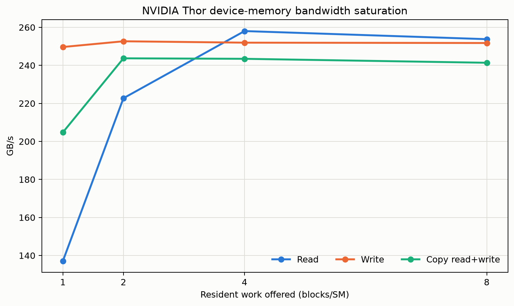

| Blocks/SM | Read GB/s | Write GB/s | Copy payload GB/s | Copy read+write GB/s |
|---:|---:|---:|---:|---:|
| 1 | 137.65 | 255.23 | 105.33 | 210.65 |
| 2 | 229.66 | 253.24 | 121.60 | 243.19 |
| 4 | **261.09** | 255.57 | 121.31 | 242.62 |
| 8 | 256.03 | 252.05 | 121.49 | 242.99 |

第一批结果显示：read 需要约 4 blocks/SM 才达到峰值，说明单个 block 提供的 memory-level parallelism 不足；write 在 1 block/SM 时已经接近饱和。继续增加到 8 blocks/SM 没有收益，反而有约 3% 的回落。copy 的 read+write 合计约 248 GB/s，而不是 read 峰值与 write 峰值之和，说明 copy 共享同一条受限的数据路径。

## 2. 访问宽度

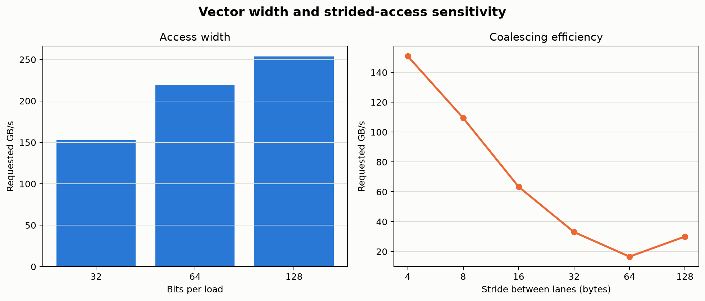

| 每条 load 宽度 | Requested GB/s |
|---:|---:|
| 32 bit | 152.60 |
| 64 bit | 221.03 |
| 128 bit | **256.61** |

相同 512 MB 数据量和相同并发配置下，128-bit load 比 32-bit 高约 65%。SASS 分别确认存在标量、`LDG.E.64` 和 `LDG.E.128`，说明这里主要反映每条指令承载数据量、load 指令吞吐与地址/循环开销，而不是 latency 差异。

## 3. Coalescing 与 stride

| Lane stride | Requested GB/s | 时间 ms |
|---:|---:|---:|
| 4 B | 151.04 | 3.5545 |
| 8 B | 110.09 | 2.4383 |
| 16 B | 63.97 | 2.0983 |
| 32 B | 33.22 | 2.0201 |
| 64 B | 16.62 | 2.0184 |
| 128 B | 30.26 | 0.5544 |

stride 1→16 时 requested bandwidth 近似按 transaction amplification 下降：warp 内地址越分散，每个实际传输 sector 中被程序请求的有效字节越少。stride=32 的时间下降不能解释为合并访问恢复；本轮新增的 NCU sector counter 已在下节确认，此时每个 warp 仍产生 32 个 sector，时间缩短来自总 load 数减少。

### NCU 把推断变成可计数的事务

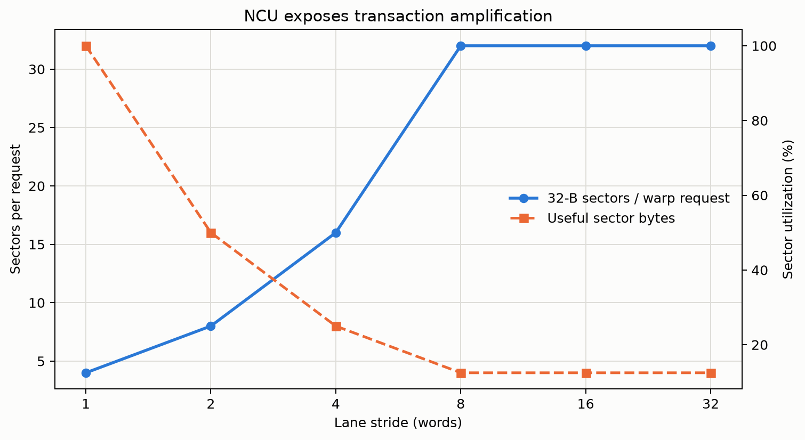

新增的 `10_hardware_probe` 保持每条 lane 为 4 B load，并让每个 warp 从 128 B 边界开始。NCU 得到：

| Lane stride | L1TEX sectors/request | Sector 有效利用率 | Long-scoreboard stall |
|---:|---:|---:|---:|
| 1 | 4 | 100% | 92.62% |
| 2 | 8 | 50% | 95.61% |
| 4 | 16 | 25% | 97.80% |
| 8 | 32 | 12.5% | 98.90% |
| 16 | 32 | 12.5% | 99.44% |
| 32 | 32 | 12.5% | 98.96% |

L1TEX 的 sector 是 32 B。stride=1 时，一个 warp 请求 128 B，恰好生成 4 个 sector；stride 每翻倍，包含相同 128 B useful data 所需的 sector 数也翻倍，直到 stride=8 达到每 lane 一个 sector的 32-sector 上限。**因此 stride=32 的 wall time 回落不是 coalescing 恢复，而是原测试为了不越过 512 MB allocation，将 load 指令总数降到了 stride=1 的 1/32。** NCU 同时显示 L1 hit 为 0、L2 hit 约 0，证明这组 counter 来自流式 device-memory miss 路径，不是 cache reuse 伪装出来的结果。

Long scoreboard 从 92.6% 升至约 99%，说明 warp 大部分不能 issue 的周期都在等待 global load dependency。LG throttle 为 0%，因此这组探针不是 LSU request queue 注入过快，而是 transaction amplification 增加了单条 warp load 的未完成 sector 与依赖等待。

## 4. 当前能推断出的 Thor 架构特征

1. device-memory read 的饱和需要比 write 更高的并发度。
2. 本轮持续带宽量级约为 read 263 GB/s、write 255 GB/s、copy fabric 248 GB/s。
3. 宽向量访问非常重要；latency 测试中 64/128-bit 延迟相同，但 bandwidth 差距明显。
4. 非合并访问的 requested bandwidth 会快速下降，warp transaction utilization 是核心限制。
5. 上述是 device allocation 的软件可见吞吐，不能仅凭 ATS 平台上的数字断言物理介质就是传统独立 HBM。

## 5. 从 device memory 到 L2、L1 与 shared

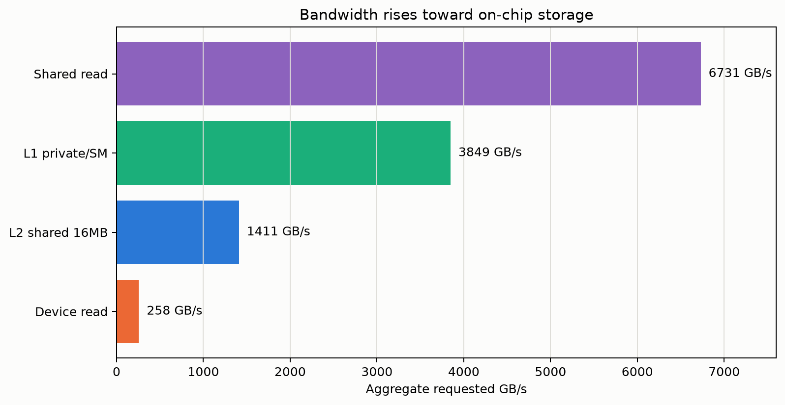

| 层级与口径 | Requested GB/s |
|---|---:|
| Device allocation，512 MB 单次流式读 | 261.09 |
| L2，共享 16 MB 工作集反复读取 | 1411.32 |
| L1，每 SM 私有 64 KB 工作集 | 3848.62 |
| Shared memory，conflict-free read | 6727.47 |

这张表展示了 GPU 存储层级为什么存在：越靠近 SM，容量越小，但可并行服务的数据量越大。这里的数字是所有 20 个 SM 的 aggregate requested bandwidth，不是单个 SM 的带宽。

第一次 cache kernel 只有一条 accumulator 依赖链，测得 L1 1435、L2 419 GB/s；改成 8 路独立 accumulator 后分别提升到 3861 和 1410 GB/s。这个对照本身就是重要的教学案例：**带宽测试也可能被计算依赖链限制；只有提供足够 ILP，测到的才更接近 memory pipe，而不是归约指令的吞吐。**

16 MB 与 32 MB 共享工作集均约 1410 GB/s，符合两者处在 32 MB L2 容量附近的预期。`.ca` 与 `.cg` 多轮均约 1410 GB/s；`.cs` 通常也约 1413 GB/s，但全量回归中出现过 1152 GB/s。`.cs` 是 streaming/evict-first 提示，在稳定重复命中时通常不改变 pipe 上限，但更容易受跨轮次 cache 状态影响，因此不能仅凭一次相等就断言它永远无影响。

## 6. Shared memory bank conflict

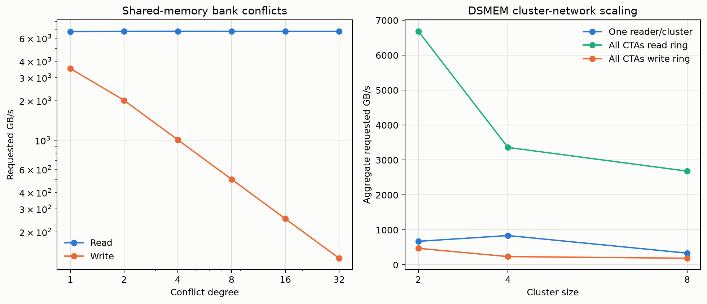

| Conflict degree | Read GB/s | Write GB/s |
|---:|---:|---:|
| 1 | 6764.90 | 3529.39 |
| 2 | 6765.31 | 2013.68 |
| 4 | 6764.49 | 1007.58 |
| 8 | 6760.00 | 503.84 |
| 16 | 6768.59 | 251.97 |
| 32 | 6760.00 | 125.99 |

写路径呈现非常清楚的 bank serialization：从 4-way 开始，冲突度每翻倍，requested bandwidth 近似减半。无冲突写约 3.53 TB/s，32-way conflict 只剩 126 GB/s。

读路径在这版 Thor 上却保持约 6.76 TB/s。该现象已经用奇数循环次数、可观察 checksum 和循环内 `LDS` SASS 复核，排除了最直接的死代码与偶数 XOR 抵消问题。

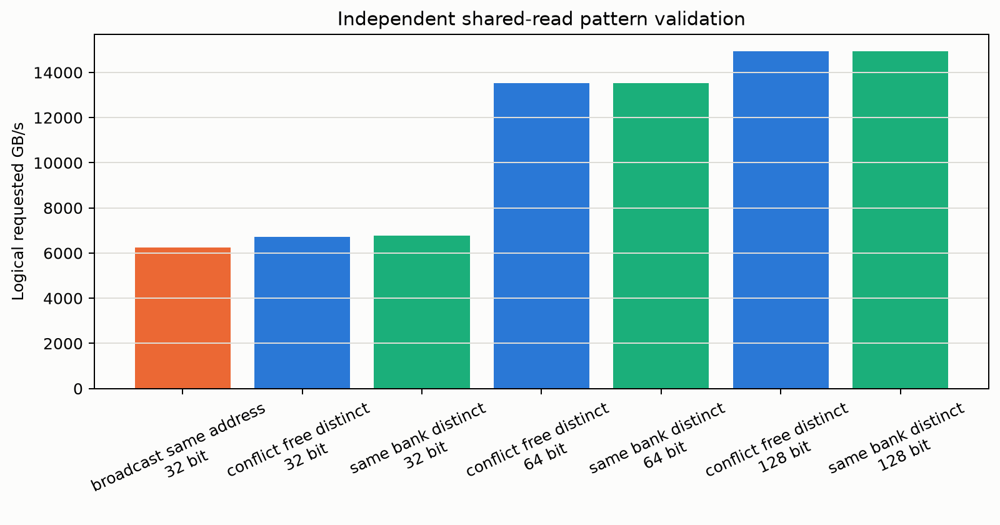

独立的 `03b_shared_patterns` 使用另一组 kernel，得到：32-bit broadcast 6268、conflict-free distinct 6765、same-bank distinct 6762 GB/s；64-bit distinct 两种模式均约 13.53 TB/s；由两条 64-bit load 组成的 128-bit logical access 两种模式均约 14.93 TB/s。不同地址落在传统同一 bank 的模式仍没有下降，而 broadcast 反而略慢约 7%。

因此结论可以加强为：**在 Thor `sm_110` 上，本报告使用的 32-bit bank 映射模式不会让 shared read throughput 随 conflict degree 序列化，但 shared write 会。** 这仍不应推广成所有 Blackwell：动态地址依赖、其他 bank 映射或 future silicon 可能不同。128-bit 项由两条 `ld.shared.v2.u32` 构成，不能解释成单条 128-bit LDS 的硬件峰值；基础 conflict/stall counter 验证见下节。

### NCU 证明“检测到冲突”不等于“读路径被序列化”

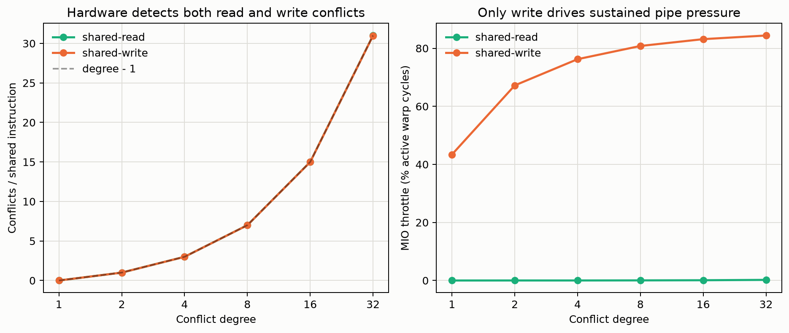

新探针用 `asm volatile` 强制每轮发射 8 条 LDS 或 STS；SASS 分别确认 8 个独立地址流。NCU 对 read 和 write 都给出严格的 `(conflict degree - 1)` conflicts/instruction：stride 1/2/4/8/16/32 对应 0/1/3/7/15/31。也就是说，旧结果并非地址映射错误，Thor 的 counter 确实把这些访问判定为 bank conflict。

关键差异在冲突之后的服务路径。read 探针从 1-way 到 32-way 始终约 6.77 ms，short-scoreboard 和 MIO-throttle 均接近 0；write 的 MIO-throttle 则从 43.4% 上升到 84.4%，旧持续吞吐测试同时呈近似反比下降。可验证的硬件解释是：

1. shared 地址仍采用能被 counter 识别的 bank 映射，不能说 Thor “没有 bank conflict”；
2. Thor 的 LDS 路径能够在本测试模式下并行服务/合并同 bank 的不同地址，冲突事件没有转化为依赖 stall；
3. STS 路径必须把多个 lane 的不同数据写入同 bank，无法像读广播那样共享返回值，并持续占满 MIO/shared 写入管线；
4. 这是对 counter 与时间的联合解释，不等同于宣称具体 bank 数、端口数或内部 crossbar 拓扑——这些物理细节没有公开 counter 可直接证明。

第一版探针曾被编译器把 8192 次 C++ 循环折叠成一次 LDS/STS；NCU 的 shared instruction counter 与 SASS 同时暴露了这个错误。最终版本改用 inline PTX。这也是本套件所谓“hardware hack”的核心方法：同时约束源码、机器指令、transaction counter 和 wall time，四者不一致时不接受结果。

## 7. DSMEM cluster 网络

| Cluster size | 同时 cluster 数 | 单向 read GB/s | Ring read GB/s | Ring write GB/s |
|---:|---:|---:|---:|---:|
| 2 | 10 | 674–3344 | **6488–6688** | **474** |
| 4 | 5 | 840–841 | 3361–3365 | 237 |
| 8 | 2 | 336 | 2684–2691 | 190 |

DSMEM 不是普通 L1/shared 的同义词：它通过 cluster 网络读取另一个 SM 的 shared memory。单发送者测试只让每个 cluster 的 rank 0 访问 peer；ring 测试让所有 CTA 同时读取下一个 rank，因此后者衡量网络 aggregate bandwidth。

全 CTA ring 在 cluster=2 时取得最高 aggregate bandwidth。cluster=8 只有两个 cluster 能并行驻留，参与的总 CTA 数从 20 降到 16，因此 aggregate bandwidth 回落。这个例子说明 cluster size 同时改变拓扑、并发 CTA 数和网络注入点数量，不能只把它理解成“cluster 越大越快”。

cluster=2 单发送者在不同进程中稳定落入约 674 或 3344 GB/s 两档；即使通过约 129 KB shared allocation 强制每 SM 只驻留一个 CTA，双峰仍存在。ring 模式却稳定在约 6688 GB/s。这说明单向 rank0→rank1 测量对 cluster 的物理放置/方向非常敏感，而双向 ring 能同时利用两侧注入路径。报告保留范围而不是挑一档作为“峰值”。

DSMEM write 比 read 慢一个数量级，并且 cluster size 增大时 aggregate write 近似反比下降：474→237→190 GB/s。所有 CTA 都向下一个 rank 写的 ring 会在 cluster 网络与对端 shared bank 上形成持续写入；与本地 shared write 的 bank serialization 一致，远端写路径无法利用 read 路径展现出的高吞吐。这里的完成时间包含末尾 cluster barrier，确保 posted store 已经对 peer 可见。

## 8. 原子吞吐：为什么热点比字节数重要

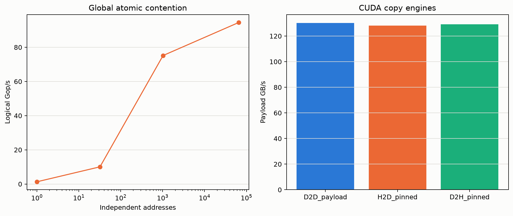

| Global 独立地址数 | 平均线程/地址 | Logical Gop/s |
|---:|---:|---:|
| 1 | 5120 | 1.31 |
| 32 | 160 | 10.07 |
| 1024 | 5 | 75.31 |
| 65536 | 0.08 | **94.03** |

原子操作不直接报告 GB/s，因为一次 read-modify-write 对 cache line 和原子单元造成的物理流量不能可靠地简化成 4 B。更有意义的指标是 logical operations/s 与 contention。

当 5120 个线程争用同一地址时，global atomic 只有 1.31 Gop/s；把请求分散到 1024 个地址后提升到 75.31 Gop/s。这说明热点原子的限制不是 device-memory 顺序带宽，而是同一地址必须维护的全序与 L2 atomic serialization。

Shared `red.shared.add` 在本机下译为 `ATOMS.POPC.INC.32`，1–256 个地址/CTA 均约 288–289 logical Gop/s。这里统计的是各 lane 的逻辑加法数，而 SASS 指令能对 warp 请求进行硬件聚合，所以它不能与 global 每地址序列化的数字按“每条 SASS”直接比较。

## 9. Copy engine 与 ATS host path

| 路径 | Payload GB/s |
|---|---:|
| D2D `cudaMemcpyAsync` | 98–131 |
| Pinned host→device | 97–129 |
| Device→pinned host | 98–131 |

Thor 报告两个 async copy engine。独立复测时三条路径都约为 128–131 GB/s；紧接完整套件运行时曾同时降到 97–98 GB/s。H2D/D2H 始终基本对称，而且量级与 kernel copy 的 121–124 GB/s payload 接近。三条路径一起变化，符合共享 SoC/系统内存状态而非单一方向链路变化的特征。对离散 GPU，host path 常受 PCIe 明显限制；本机 ATS/SoC 形态下不能沿用这种直觉，这正是报告坚持使用 “host pinned path” 而不是直接写 “PCIe bandwidth” 的原因。

Copy 的 payload 只计算一份 512 MB 数据；若描述 device fabric 活动，D2D 同时包含一次读和一次写，约等效 259 GB/s read+write 流量。必须先说明采用哪种口径，否则同一个 copy 可以看起来差整整两倍。

## 10. tcgen05：从 instruction latency 到持续 TFLOP/s

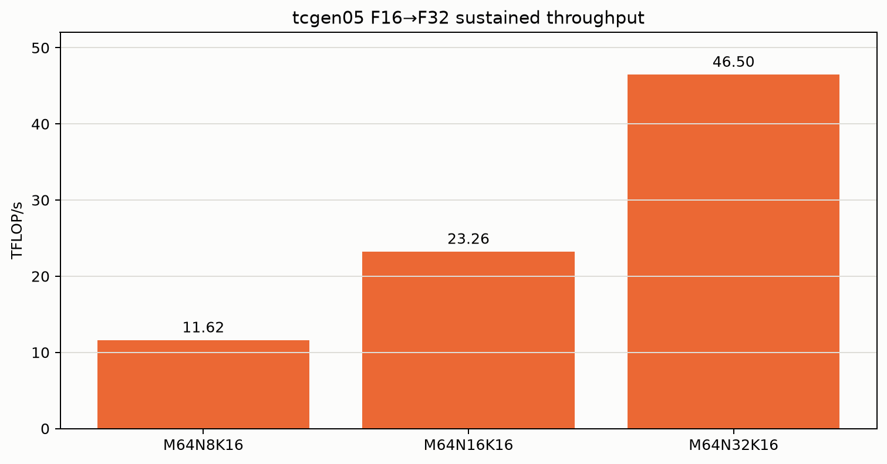

| F16→F32 shape | Blocks | MMA 指令数 | TFLOP/s |
|---|---:|---:|---:|
| M64N8K16 | 20 | 1,310,720 | 11.624 |
| M64N16K16 | 20 | 1,310,720 | 23.249 |
| M64N32K16 | 20 | 1,310,720 | **46.498** |

三个 shape 使用相同数量的 `tcgen05.mma` 指令，运行时间也都约 1.848 ms，但 N 每翻倍，一条指令完成的 FMA 数翻倍，所以 TFLOP/s 也严格翻倍。这与 Latency 报告里三个 N shape 都约 44.23 cycle 的稳态间隔相互印证：在这个范围内，指令 issue rate 基本不随 N 变化，而每条指令承载的数学工作量随 N 增长。

FLOP 计数采用 `2×M×N×K`，因为一次乘加算一次乘法和一次加法。这个约定必须写清楚；若按 FMA=1 operation，表中的数字会减半。该测试反映 20 个 SM 同时运行一个 CTA 的持续 instruction throughput，不包含 global-memory 矩阵装载，因此是 Tensor Core pipe 的微基准，不是完整 GEMM 性能。

## 11. `cp.async`：在飞深度如何隐藏延迟

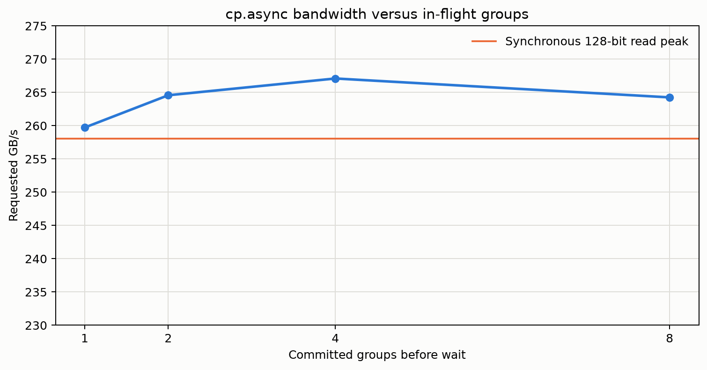

| Commit 后统一等待的在飞 group 数 | Requested GB/s |
|---:|---:|
| 1 | 259.72 |
| 2 | 264.57 |
| 4 | **267.09** |
| 8 | 264.25 |

每个线程搬运 16 B，整个 CTA 每 tile 搬 4 KB global→shared。只有一个 group 时，每轮等待使 pipeline 不能完全隐藏完成延迟；增加到两个 group 后已达到 264 GB/s，四组达到峰值，八组没有继续提升。

这个结果把 Latency 和 Bandwidth 联系起来：异步指令本身并没有让物理内存变快，它允许程序在等待前积累多个未完成请求。当在飞深度足够覆盖 latency 后，吞吐回到约 263 GB/s 的 device-read 上限。SASS 已确认核心搬运为 `LDGSTS.E.BYPASS.128`。

## 12. TMA：tile 大小和 batching 缺一不可

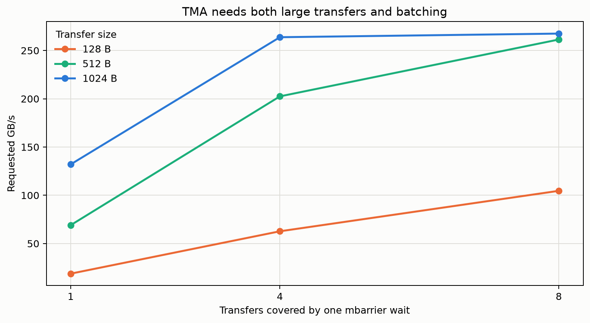

| 每次 TMA bytes | Batch 1 | Batch 4 | Batch 8 |
|---:|---:|---:|---:|
| 128 B | 18.80–18.83 | 62.70–63.02 | 98.73–104.62 |
| 512 B | 63.98–69.06 | 168.70–202.50 | 197.20–261.40 |
| 1024 B | 117.89–132.05 | 197.51–263.79 | **200.73–267.54** |

表中单位为 requested GB/s。TMA 每次传输都需要描述、mbarrier transaction accounting 和完成通知；只有 128 B 且每次立即等待时，固定控制成本占主导，带宽仅 18.84 GB/s。增大 tile 会摊薄固定开销，batching 多个 transfer 再统一等待则增加在飞深度。

两次正式全量回归中 1024 B×8 分别约为 201 和 268 GB/s，隔离轮次也分别复现过这两个平台状态，因此表中保留范围。绝对值受 ATS/SoC memory 状态影响，但趋势稳定：tile 越大、batch 越深，越能摊薄 TMA 控制成本。TMA 的价值不是突破物理内存上限，而是用更少的线程和地址指令描述大块搬运。SASS 已确认核心操作为 `UBLKCP.S.G`。

## 12.1 NCU 管线指纹：确认数据走了哪条硬件路径

`profile_ncu_pipelines.sh` 对每条路径只截取一个代表 kernel，得到：

| 路径 | 代表硬件 counter | 结果 | 硬件含义 |
|---|---|---:|---|
| `cp.async` / LDGSTS | `inst_executed_op_ldgsts` | 1,048,576 | 与源码发射数一致，证明搬运由 LDGSTS pipe 承担 |
| `cp.async`, stage=1 | long scoreboard | 96.55% | 单 group 时 warp 主要等待异步数据完成；增加 group 是隐藏此等待，不是提高介质峰值 |
| TMA 128 B×1 | TMA global read bytes | 536,870,912 B | 完整 512 MiB 数据由 TMA/XBAR 路径读入，不是普通 LSU load |
| TMA 128 B×1 | TMA load instructions | 4,194,304 | 恰为 512 MiB / 128 B，解释小 tile 固定指令/屏障成本 |
| DSMEM ring read | sectors/request | 4 | 每个 warp 的 32×4 B 请求形成 4 个 32 B sector；DSMEM 低效来自 cluster 网络/注入并发，而非此访问不合并 |
| tcgen05 M64N8K16 | TC pipe instructions | 1,310,780 | 与程序预期的 1,310,720 次 MMA 仅差 60 条 setup 类 TC-pipe 指令，确认算力口径对应真实 TC pipe 活动 |

一个有价值的负结果是：`cp.async` 的 `...ldgsts_cache_access` request/sector counter 为 0，但 `inst_executed_op_ldgsts` 非零且 SASS 是 `LDGSTS.E.BYPASS.128`。这不是“没有搬数据”，而是 **BYPASS 路径不计入名为 cache_access 的子计数器**。报告因此不把 metric 名称机械等同于物理流量，而用 instruction counter、SASS 和总字节数交叉验证。

## 13. 用 Roofline 把计算与内存连接起来

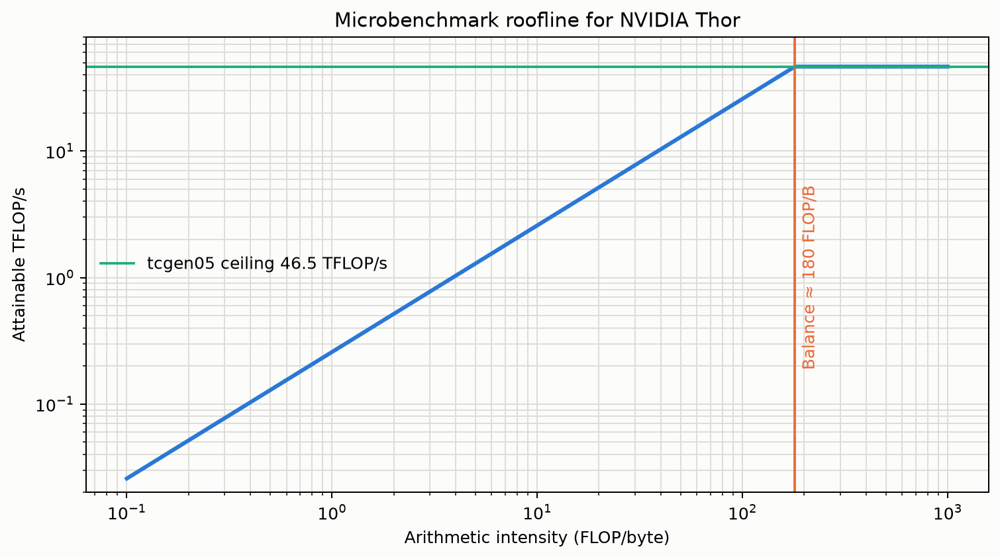

用本报告的稳定峰值构造一个微基准 Roofline：device read 约 261 GB/s，M64N32K16 tcgen05 约 46.48 TFLOP/s。两条上限的交点为：

`46.50 TFLOP/s ÷ 0.258 TB/s ≈ 180 FLOP/byte`

这叫 machine balance。若一个 kernel 每读写 1 byte 只做 10 FLOP，即使访存完全合并，内存 roof 也只有约 2.58 TFLOP/s；继续优化 Tensor Core 指令不会有明显收益。只有 arithmetic intensity 接近或超过 180 FLOP/B，才可能逐渐转为 tcgen05 compute-bound。

Roofline 不是对真实应用的性能保证：这里的 memory ceiling 来自纯读，compute ceiling不包含矩阵装载，而真实 kernel 还受 occupancy、指令混合、同步和 tile 边界影响。它的价值是帮助判断优化方向——先问“缺 FLOP 还是缺 byte”，再决定优化计算、数据复用还是搬运 pipeline。

## 14. 尚待扩展与当前硬件限制

- Shared 动态地址依赖、不同数据宽度和更复杂地址置换；当前 NCU 已完成基础 read/write conflict 与 stall counter 验证。
- DSMEM 双向读写混合与更细的物理 cluster placement 分类。
- tcgen05 FP8/FP4、block scaling 和稀疏 shape；当前正式结果只覆盖 F16→F32。
- 更广的 NCU 自动化：TMA/LDGSTS、DSMEM 与 tcgen05 pipe counter；当前已通过 `sudo ncu` 完成 global sector 和 shared conflict/stall 扫描。
- P2P/NVLink；当前机器只有一张 GPU，无法实测。

## 原始数据

- 正式全量回归：`results/thor-*-20260809-133222.txt` 及同名 `.exit`（十项均为 0）
- `results/01_global_memory.sass.txt`
- 最新 `results/thor-cache-*.txt`、`thor-shared-*.txt`、`thor-dsmem-*.txt`
- 最新 `results/thor-shared-patterns-*.txt` 与 `results/thor-dsmem-rw-*.txt`
- 最新 `results/thor-atomics-*.txt`、`thor-copy-engines-*.txt`
- 最新 `results/thor-tcgen05-*.txt` 与 `results/07_tcgen05_throughput.sass.txt`
- 最新 `results/thor-async-*.txt` 与 `results/08_async_copy.sass.txt`
- 最新 `results/thor-tma-*.txt` 与 `results/09_tma.sass.txt`
- `results/02_cache_working_set.sass.txt`、`03_shared_memory.sass.txt`、`04_dsmem.sass.txt`
- NCU 正式扫描：`results/ncu-20260809-140740/summary.csv` 与同目录 18 份原始 counter CSV
- NCU 管线指纹：`results/ncu-pipelines-20260809-141203/summary.csv` 与四份原始 counter CSV
- NCU 探针 SASS：`results/10_hardware_probe.sass.txt`

## 延伸阅读

- NVIDIA CUDA C++ Best Practices Guide：带宽计算、global coalescing、strided access、shared memory banks 与异步复制：<https://docs.nvidia.com/cuda/cuda-c-best-practices-guide/index.html>
- NVIDIA CUDA Programming Guide — Asynchronous Data Copies：LDGSTS、TMA、async proxy、barrier 与 pipeline 编程模型：<https://docs.nvidia.com/cuda/cuda-programming-guide/04-special-topics/async-copies.html>
- NVIDIA PTX ISA：本报告使用的 cache operator、cluster shared、mbarrier、`cp.async` 与 `tcgen05` 指令语义：<https://docs.nvidia.com/cuda/parallel-thread-execution/>

通用 Best Practices 将不同地址落入同一 shared bank 描述为需要序列化；本报告的 Thor read 结果与这条通用规则不同，而 write 结果符合。正因如此，报告将它限定为当前 `sm_110`、当前 SASS 和当前地址模式下的实测观察，而不是改写通用 CUDA 编程规则。
