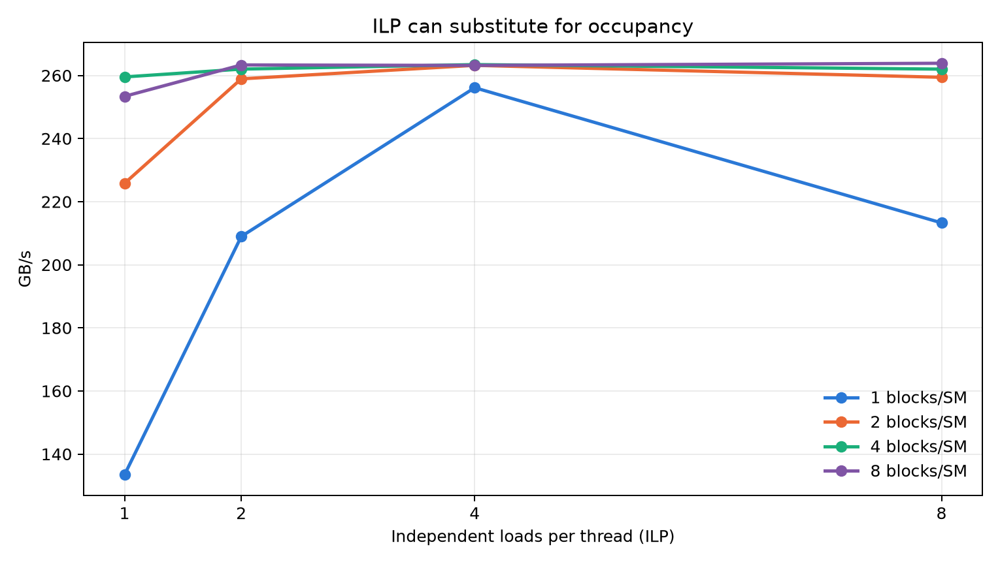
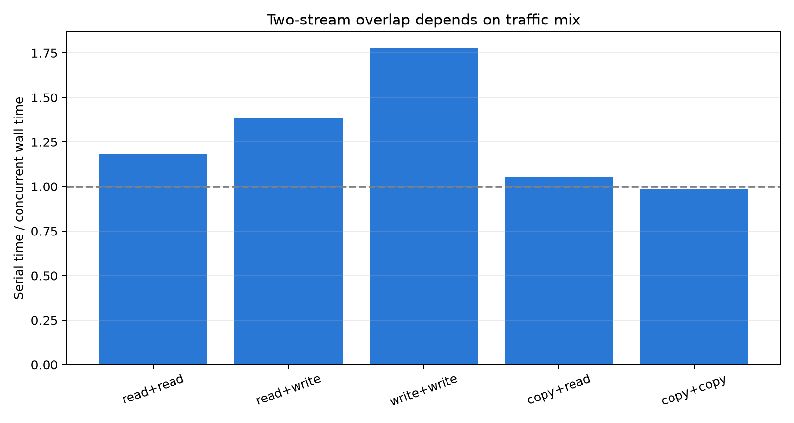

# NVIDIA Thor 吞吐微架构：从 MLP、数据复用到共享资源竞争

## 摘要

本报告在 NVIDIA Thor（Blackwell，`sm_110`）上研究持续带宽如何由事务效率、memory-level parallelism（MLP）、缓存复用、shared/DSMEM、异步搬运和多 workload 竞争共同决定。实验不把一个 GB/s 数字当作架构结论，而是通过控制访问宽度、stride、ILP、blocks/SM、工作集、TMA tile/batch 和 stream 组合，逐步定位限制来源；关键路径再以 SASS 与 Nsight Compute counter 交叉验证。

Thor 的 device-memory read ceiling 约为 261–263 GB/s。单 block/SM、ILP=1 时只有 133 GB/s；提高到 ILP=4 或 4 blocks/SM 均可接近峰值，说明 ILP 和 occupancy 是提供 MLP 的两种来源。规则复用把聚合吞吐提高到 L2 的 1.41 TB/s、L1 的 3.85 TB/s 和 shared memory 的 6.73 TB/s。`cp.async` 与 TMA 只有在增加在飞深度、摊薄控制成本时才接近 device ceiling；立即等待的小 TMA tile 仅约 19 GB/s。

Shared write 的 bank conflict 按冲突度近似串行化，而当前 Thor/SASS/静态地址模式下的 shared read 即使 counter 报告冲突，也未出现吞吐下降。DSMEM 吞吐更受活跃 cluster/CTA 注入点和 placement state 影响，而非逻辑 rank 距离。双 stream 不会产生两套 memory fabric：read+read、copy+copy 最终仍共享约 234–262 GB/s 的 ceiling。

这些结果将吞吐问题归纳为四个依次检查的条件：每次事务中有多少有效字节、是否有足够在飞请求、数据能否在更近层级复用，以及多个 workload 是否竞争同一服务路径。

## 1. 研究问题

1. Thor 的 device-memory path 需要多少并发才能饱和，ILP 与 occupancy 各起什么作用？
2. 访问宽度和 coalescing 如何改变 instruction/transaction efficiency？
3. L2、L1、shared 与 DSMEM 的吞吐上限由什么约束？
4. `cp.async`、TMA 与 multicast 如何改变控制成本和 bytes-in-flight？
5. Tensor Core 与内存 ceiling 如何通过 Roofline 连接？
6. 多 stream 同时运行时，哪些资源可以重叠，哪些仍然共享？

研究顺序从单 workload 的 device ceiling 出发，先解释如何达到上限，再研究如何通过复用避开它，最后观察多个 workload 如何竞争同一上限。

## 2. 平台、指标与证据

### 2.1 环境和运行规则

- GPU：NVIDIA Thor，`sm_110`，20 SM，32 MiB L2；
- CUDA allocation：主流式测试每个 buffer 512 MiB；
- 计时：预热后运行 7 次，稳定项目取最短 CUDA event 时间；
- 波动项目：报告隔离进程/全量回归的范围，不挑选单个最高值；
- 平台：ATS/统一内存形态，因此使用 device-memory/host-pinned path，不套用离散 HBM/PCIe 名称。

CUDA 的统一内存文档指出，ATS 与硬件一致性平台的数据位置和访问方式依赖系统实现 [R1]。所以本报告分析的是 CUDA allocation 的软件可见吞吐及硬件 counter，不从 allocation API 单独推断物理内存介质。

### 2.2 指标口径

| 指标 | 定义 | 适用场景 |
|---|---|---|
| requested GB/s | 程序有效字节/时间 | load/store、cache/shared/DSMEM |
| payload GB/s | 一份逻辑数据/时间 | D2D/H2D/D2H copy |
| fabric GB/s | copy 读+写总流量/时间 | 与单向 read/write ceiling 比较 |
| logical Gop/s | 程序语义上的原子操作数/时间 | contention 扫描 |
| TFLOP/s | `2×M×N×K×MMA/s` | FMA 计乘法与加法各一次 |

### 2.3 证据链

持续时间是主证据；SASS 用于确认访问宽度、循环内指令和专用路径；NCU 用于确认 request/sector、hit/miss、stall 与 pipe instruction。Counter 名称不直接等同于物理结构：例如 `LDGSTS.E.BYPASS.128` 的 cache-access 子计数为 0，但 LDGSTS instruction counter、SASS 和结果字节都成立，说明 BYPASS 不进入该子计数，而非“没有搬运”。

### 2.4 从公开 SM 资源到本报告的吞吐假设

Thor 官方示例报告 20 SM、每 SM 128 CUDA cores、32 MiB L2，并标记 integrated GPU sharing host memory [R10]。CC 11.0 的公开资源上限为每 SM 48 resident warps、1536 threads、64K 32-bit registers、256 KiB unified data cache、最高 228 KiB shared memory 和 32 个 shared banks [R11]。

这些数字不是规格表装饰，而是后续实验的约束：

- 48-warps 上限给出 occupancy 能提供的 latency-hiding 并发预算；ILP 则在每个 warp 内补充独立请求；
- 256 KiB unified capacity 解释 L1 工作集边界，但 shared carveout 会与 L1 容量竞争；
- 32 banks 给出 shared address conflict 的逻辑分类，却不预先决定冲突一定转化为多少 stall；
- 32 MiB L2 是全 SM 共享容量，L2 bandwidth 必然是 aggregate service，而非每 SM 乘上独立 32 MiB；
- integrated memory 使 GPU、copy engine 与其他 SoC client 最终竞争 EMC/MC/DRAM 系统，而不是独享离散 HBM controller。

```text
20 SMs
 ├─ warp schedulers / registers / LSU
 ├─ 256 KiB unified L1/texture/shared capacity per SM
 │    └─ cluster fabric ─► peer-SM shared (DSMEM)
 ├─ TMA async data-movement path
 └─ tcgen05 Tensor Core ─► TMEM accumulator
             │
          32 MiB shared L2
             │
      SoC memory controller / EMC / DRAM
```

NVIDIA 的通用 Blackwell Tuning Guide 主要列举 B200/GB200（CC 10.0）与 RTX Blackwell（CC 12.x）；本报告只借用跨 Blackwell 公开的 cluster/DSMEM 与 unified-cache 语义，不使用 B200 的 HBM、dual-die、126 MiB L2 或 NVLink 数字解释 Thor [R12]。

## 3. Device-memory ceiling：饱和首先需要 MLP

### 3.1 SM 并发扩展


| Blocks/SM | Read | Write | Copy payload | Copy fabric |
|---:|---:|---:|---:|---:|
| 1 | 137.65 | 255.23 | 105.33 | 210.65 |
| 2 | 229.66 | 253.24 | 121.60 | 243.19 |
| 4 | **261.09** | 255.57 | 121.31 | 242.62 |
| 8 | 256.03 | 252.05 | 121.49 | 242.99 |

单位为 GB/s。Read 从 1 到 4 blocks/SM 提升 90%，表明单 block 没有提供足够 outstanding loads；write 在 1 block/SM 已接近饱和，说明其 posted/decoupled 路径较容易积累请求。Copy 同时消费读与写，fabric 约 243 GB/s 而不是 read+write 两个单向峰值之和，显示两侧最终共享系统瓶颈。

### 3.2 ILP 与 occupancy 是两种 MLP 来源



| Blocks/SM | ILP 1 | ILP 2 | ILP 4 | ILP 8 |
|---:|---:|---:|---:|---:|
| 1 | 133 | 209 | **256** | 213 |
| 2 | 226 | 259 | **263** | 259 |
| 4 | 260 | 262 | 263 | 262 |
| 8 | 253 | 263 | 263 | 264 |

NCU 对 `1×ILP1`、`1×ILP4` 与 `4×ILP1` 记录相同的 1,048,576 requests 和 16,777,216 sectors，排除了工作量差异。`1×ILP4` 的 active warps 仍约 16%，但带宽从 133 升至 256 GB/s；`4×ILP1` 用约 65% active warps 达到 260 GB/s。二者通过不同方式提供相近数量的独立请求。

因此 occupancy 不是性能目标，而是隐藏延迟的候选机制。低 occupancy 只要每线程有足够 ILP，也能饱和 memory pipe；高 occupancy 若所有 warp 都在同一依赖链上等待，也不保证达到峰值。ILP=8 在 1 block/SM 时回落，说明覆盖延迟后继续展开会增加寄存器、指令与调度成本。

结合 CC 11.0 最多 48 resident warps 可以更具体地理解：1 block/SM 配置只暴露约 8 个 active warp，而 4 blocks/SM 约 32 个；前者用 ILP=4 在较少 warp 中制造多个独立地址流，后者用更多 warp 在 scoreboard 等待时轮换。两条路径都把 outstanding sector 数推到足够覆盖约 800-cycle device-path latency 的区域。继续增加 blocks/SM 或 ILP 已不能提高 memory-controller 完成率，只会增加 scheduler/register 开销。

## 4. 事务效率：访问宽度与 coalescing

### 4.1 每条指令承载的数据量


| Load width | Requested GB/s |
|---:|---:|
| 32 bit | 152.60 |
| 64 bit | 221.03 |
| 128 bit | **256.61** |

Latency 报告中 64/128-bit L2 load 都约 248 cycle，所以 128-bit 的吞吐优势不是单次依赖访问更快，而是每条 load、地址更新和循环控制承载更多有效字节。SASS 分别保留标量、`LDG.E.64` 与 `LDG.E.128`。

### 4.2 Stride 造成 transaction amplification


| Lane stride（4 B 单位） | Sectors/request | Sector 有效利用率 | Long scoreboard |
|---:|---:|---:|---:|
| 1 | 4 | 100% | 92.62% |
| 2 | 8 | 50% | 95.61% |
| 4 | 16 | 25% | 97.80% |
| 8 | 32 | 12.5% | 98.90% |
| 16 | 32 | 12.5% | 99.44% |
| 32 | 32 | 12.5% | 98.96% |

L1TEX sector 为 32 B。warp 请求相邻 32×4 B 时由 4 个 sector 服务；stride 增大后，包含相同 128 B useful data 所需的 sector 成倍增长，直到每 lane 一个 sector。CUDA Best Practices Guide 也以四个 32 B transaction 描述相邻 4 B word 的合并访问 [R2]。

原流式测试 stride=32 的 wall time 回落，是为了不越过 512 MiB allocation 而减少了 load 总数，不是 coalescing 恢复。NCU 显示 L1/L2 近全 miss、LG throttle 为 0、long scoreboard 逼近 99%，说明限制来自 transaction amplification 后的长依赖等待，而非 cache reuse 或 LSU queue 注入过快。

## 5. 数据复用：把流量移到更靠近 SM 的层级

### 5.1 层次吞吐


| 层级 | 工作集 | Requested GB/s |
|---|---|---:|
| device path | 512 MiB 单次流式读 | 261.09 |
| L2 | 16 MiB 全 SM 共享反复读 | 1411.32 |
| L1 | 每 SM 64 KiB 私有反复读 | 3848.62 |
| shared | conflict-free read | 6727.47 |

越靠近 SM 的层级容量更小，但可由更多本地端口并行服务。最初 cache kernel 只有一个 accumulator 依赖链时，L1/L2 仅 1435/419 GB/s；改成 8 路独立 accumulator 后升至 3861/1410 GB/s。Cache hit 决定请求停在哪一层，ILP 决定是否能把该层服务能力用满，二者缺一不可。

L1 与 shared 共享 256 KiB **容量池**，但吞吐数据证明它们不是一条完全相同的服务 pipe：L1 load 仍经过 L1TEX/coalescing/tag lookup，shared 是软件寻址的 banked scratchpad。因而 3.85 与 6.73 TB/s 的差距可以解释为不同访问前端和端口行为，而不是“同一块 SRAM 测出了两个互相矛盾的峰值”。公开资料没有给出 Thor 的端口数，报告止于软件可观察的服务路径差异。

### 5.2 L2 persistence 保护跨 kernel reuse


Thor 报告 24 MiB persisting reserve 和 128 MiB access-policy window。先预热 hot set，再用 128 MiB 流污染 cache：

| Hot set | Normal reload | Persisting reload | 加速 |
|---:|---:|---:|---:|
| 4 MiB | 159–207 | 230–529 | 1.45–2.56× |
| 16 MiB | 211–245 | 343–946 | 1.63–3.99× |
| 32 MiB | 241–252 | 310–328 | 1.25–1.35× |

单位为 GB/s。16 MiB 完全落在 reserve 内时收益最高；32 MiB 超出 reserve，`hitRatio` 按 24/32 设置，收益回落。CUDA 的 access-policy 语义是提高 persisting line 对 set-aside L2 的使用优先级，且多个 window 仍共享该容量 [R3]。它降低的是污染后的驱逐概率，不提高 L2 pipe 本身的 1.41 TB/s 上限。

NCU kernel replay 下 normal/persist 都接近全 miss。Nsight Compute 默认会在 replay pass 前 flush cache，官方文档说明这会让 kernel 以隔离冷缓存状态执行 [R4]。因此 persistence 以普通 CUDA event 为主证据，replay 结果是 profiling 边界而非反证。

## 6. Shared memory：相同 bank 映射产生读写非对称


| Conflict degree | Read GB/s | Write GB/s |
|---:|---:|---:|
| 1 | 6764.90 | 3529.39 |
| 2 | 6765.31 | 2013.68 |
| 4 | 6764.49 | 1007.58 |
| 8 | 6760.00 | 503.84 |
| 16 | 6768.59 | 251.97 |
| 32 | 6760.00 | 125.99 |

Write 从 4-way 起随冲突度翻倍近似减半，符合同一 bank 不同 lane 数据需要序列化服务的结果。Read 却稳定在约 6.76 TB/s。独立 `03b_shared_patterns` 在 32/64/逻辑 128-bit 静态访问上复现同 bank distinct 与 conflict-free 吞吐相近；checksum 和 SASS 排除了死代码。


NCU 对 read/write 都报告严格的 `(degree-1)` conflicts/instruction，证明地址确实落入传统同 bank 分类。差别出现在冲突后的服务：read 的 short-scoreboard/MIO-throttle 近零，write 的 MIO-throttle 从 43% 升至 84%。

证据允许的结论是：Thor 在当前静态读模式下能服务或合并这些同 bank 请求，使 counter 事件不转化为时间 stall；write 无法共享不同 lane 的写数据而发生序列化。CUDA 的通用模型仍警告 bank conflict 可能串行化 [R5]，所以本观察不能扩展成“Blackwell 没有 read bank conflict”，也不足以反推端口数或内部 crossbar。

CC 11.0 官方表仍明确列出 32 banks [R11]，所以反常点不在“Thor 改成了别的 bank 数”。更可能的未知项位于 bank 冲突检测之后的 read service/merge 或 counter 定义：counter 记录逻辑冲突，而 elapsed time 没有相应 replay。要区分多端口、请求合并与 counter 语义，需要动态数据相关地址、lane 返回值逐一校验及更细的 MIO/LDS transaction counter；当前不选择其中一种当作已知硬件。

## 7. DSMEM：逻辑 rank 不是物理距离

### 7.1 Cluster size 同时改变网络和驻留

| Cluster size | 同时 cluster 数 | Ring read | Ring write |
|---:|---:|---:|---:|
| 2 | 10 | 6488–6688 | 474 |
| 4 | 5 | 3361–3365 | 237 |
| 8 | 2 | 2684–2691 | 190 |

单位为 GB/s。cluster=8 只允许两个 cluster 同时驻留，活跃 CTA 从 20 降至 16；aggregate 注入点减少会直接降低吞吐。Read 远高于 write，与本地 shared read/write 非对称方向一致，但跨 SM network 与末尾 cluster barrier 也包含在结果中，不能把差值全部归于 bank。

### 7.2 Placement state 比 rank delta 更能解释离散档位


cluster=4 在首个进程出现 +1/+2/-1 为 1.53/3.33/3.33 TB/s，后续进程三个方向都约 3.14–3.20 TB/s；cluster=8 各 delta 基本为 2.50–2.67 TB/s，没有稳定距离衰减；cluster=2 出现约 1.34 与 6.20–6.31 TB/s 两档。

CUDA 只保证 cluster blocks 在一个 GPC 内同时执行并可访问 distributed shared memory [R6]，未承诺 rank 编号映射到物理 mesh 距离。现有数据因此支持“进程/launch 的物理 placement state 与活跃注入点形成离散档位”，不支持“rank 越远越慢”的线性模型。

Blackwell Tuning Guide 明确说明 DSMEM 可与 L2 access 同时使用，并建议像 global memory 一样按 32 B segment 合并与对齐 [R12]。这给本机结果两个更强的架构解释：DSMEM 不是经 L2 伪装出来的 peer load，而是 cluster fabric 的独立路径；cluster size 增大时，既可能改变 fabric placement，也会因每 cluster CTA 数增加而降低全 GPU active cluster 数。Ring read 接近本地 shared aggregate bandwidth，表示 20 个 SM 的并行注入总量，不代表任意一条 SM-to-SM link 有 6 TB/s。

## 8. 原子与 copy：热点、流量口径和系统状态

### 8.1 Global atomic 受每地址全序限制


| 独立 global 地址数 | 平均线程/地址 | Logical Gop/s |
|---:|---:|---:|
| 1 | 5120 | 1.31 |
| 32 | 160 | 10.07 |
| 1024 | 5 | 75.31 |
| 65536 | 0.08 | 94.03 |

请求从单热点分散到 1024 个地址后提升约 57×。限制不是 4 B 数据的顺序带宽，而是同一地址 read-modify-write 的全序与 L2 atomic serialization。原子优化应先减少热点：warp/block 内聚合、分片计数器、分层归约通常比追求“atomic GB/s”更有意义。

Shared reduction 约 288–289 logical Gop/s，SASS 为能聚合 warp 请求的 `ATOMS.POPC.INC.32`。Logical operation 数不能按 SASS 指令条数直接与 global atomic 比较。

### 8.2 Copy engine 与 ATS host path

| 路径 | Payload GB/s |
|---|---:|
| D2D `cudaMemcpyAsync` | 98–131 |
| pinned host→device | 97–129 |
| device→pinned host | 98–131 |

三条路径会随全量回归状态一起从约 128–131 降到 97–98 GB/s，H2D/D2H 又保持对称。这更像共享 SoC/system-memory 状态变化，而不是离散 PCIe 单方向瓶颈。D2D 的 130 GB/s payload 同时产生一次读与一次写，fabric 口径约 260 GB/s；报告不会用两个口径制造虚假差距。

Thor 平台文档给出了这一现象的硬件背景：EMC/MC/DRAM 采用动态频率缩放，BPMP 会根据 GPU、PCIe 等 client 的 bandwidth QoS request 与实时利用率选择 EMC 档位 [R13]。因此三条 copy 路径一起变化、TMA 也形成约 201/268 GB/s 两档，与共享 SoC memory clock 状态是相容的。不过当前采集没有同步记录 `/sys/class/devfreq/bwmgr` 与 MSS profile，故该机制仍是有官方依据的候选解释，而不是已完成相关性验证的结论。

## 9. 异步数据搬运：tile、batch 与完成语义

### 9.1 `cp.async` 通过在飞 group 隐藏等待


| 在飞 group | Requested GB/s |
|---:|---:|
| 1 | 259.72 |
| 2 | 264.57 |
| 4 | **267.09** |
| 8 | 264.25 |

SASS 为 `LDGSTS.E.BYPASS.128`。1→4 group 增加在飞请求并覆盖完成等待，8 group 已无收益。Latency 报告中立即 wait 的 `cp.async` 比同步等价路径略慢，二者共同证明异步 copy 不改变物理内存 latency；它允许把等待移到更晚的位置，与其他 transfer 或计算重叠。CUDA 也将 LDGSTS 的目标描述为 global→shared 的异步 element-wise 传输 [R7]。

从 SM 资源角度，LDGSTS 仍由各参与线程生成 element address，只是数据可绕过寄存器直接进入 shared；所以小而不规则的 per-lane copy 与它匹配。TMA 则由单线程描述 bulk/tensor 区域，硬件接管地址生成，减少 warp issue 与 register 占用 [R7]。两者不是“旧/新版本谁更快”的简单替代，而是针对不同 copy granularity 的两条异步数据路径。

### 9.2 TMA 需要用大 tile 摊薄固定成本


| Bytes/TMA | Batch 1 | Batch 4 | Batch 8 |
|---:|---:|---:|---:|
| 128 | 18.80–18.83 | 62.70–63.02 | 98.73–104.62 |
| 512 | 63.98–69.06 | 168.70–202.50 | 197.20–261.40 |
| 1024 | 117.89–132.05 | 197.51–263.79 | **200.73–267.54** |

每次 TMA 都需要描述、transaction accounting 与完成通知。128 B×batch1 的固定控制成本主导；增大 tile 减少每 byte 的发射/同步开销，增大 batch 提高 bytes-in-flight。官方指南也建议尽量以更少、更大的 bulk copy 发起 TMA，并用多 stage 预取与计算重叠 [R7]。

1024 B×8 在不同平台状态形成约 201 与 268 GB/s 两档，趋势稳定但绝对值受 ATS/SoC 状态影响。TMA 的价值是用少量线程和地址指令描述大块/多维数据，不是突破 device-memory ceiling。

### 9.3 TMA multicast 去重 source，不扩宽 delivery pipe


| Fanout | Unicast delivered | Multicast delivered | Multicast source 口径 |
|---:|---:|---:|---:|
| 2 | 30.70 | 29.17 | 14.58 |
| 4 | 30.98 | 29.14 | 7.28 |

单位为 GB/s。fanout=2 时，NCU 记录 unicast 524,288、multicast 262,144 条 TMA load，发射数减半；二者 TMA read-bytes 都是 512 MiB，表明该 counter 统计 fan-out 后的 delivered bytes。当前 kernel 每次 transfer 后立即等待，delivery/completion pipe 成为瓶颈，所以 source 去重未提高 delivered GB/s。

cluster=2/4 需要隔离进程与重试才能稳定；cluster=8 曾连续失败，保留为 experimental。成功性能不能掩盖 CUDA 13.3/Driver 595.78 的运行稳定性边界。

## 10. Tensor Core 与 Roofline：先判断缺 FLOP 还是缺 byte

### 10.1 `tcgen05` 持续吞吐


| F16→F32 shape | MMA 数 | TFLOP/s |
|---|---:|---:|
| M64N8K16 | 1,310,720 | 11.624 |
| M64N16K16 | 1,310,720 | 23.249 |
| M64N32K16 | 1,310,720 | **46.498** |

三个 shape 的指令数和运行时间近似相同，N 翻倍使每条指令的 FMA 数翻倍，TFLOP/s 严格翻倍。Latency 报告中三种 shape 的稳态 interval 都约 44 cycle，形成独立交叉验证。该测试不加载 global matrix，是 Tensor Core pipe 微基准而非完整 GEMM。

Blackwell `tcgen05` 的关键硬件变化是 TMEM：accumulator（以及可选 A operand）驻留在专用片上 memory，而不是长期占用普通 register file；MMA 由单线程发起，还可用 CTA pair 扩大 collective tile [R14]。这解释了为什么一个 CTA 可以用很少的普通 issuing threads 驱动大量矩阵工作，也说明 46.5 TFLOP/s 的前提不仅是 Tensor Core 算术单元，还包括 SMEM/TMEM 数据准备与异步完成协议。完整 GEMM 若无法用 TMA 持续供给 A/B，或 TMEM allocation/epilogue 成本未被 K-loop 摊薄，就达不到这个纯 pipe ceiling。

### 10.2 微基准 Roofline


用 46.50 TFLOP/s 与约 0.258 TB/s 构造教学 ceiling，machine balance 为约 180 FLOP/B。若 kernel 的 arithmetic intensity 为 10 FLOP/B，memory roof 约为 2.58 TFLOP/s；提高 Tensor Core 峰值不会改变主要限制。Roofline 用 FLOP/byte 和 FLOP/s 判断 memory-bound/compute-bound 的方法见 NVIDIA/NERSC 说明 [R8]。

两个 ceiling 来自分离的纯计算和纯读 microbenchmark，真实 kernel 还受 load/store 混合、occupancy、同步和 tile 边界影响。Roofline 用于选择优化方向，不是性能保证。

## 11. 多 stream 并发：重叠不等于资源复制



| 组合 | Serial/wall | 总 fabric GB/s | 解释 |
|---|---:|---:|---|
| read+read | 1.19× | 262 | 共享 read ceiling |
| read+write | 1.39× | 238 | 有部分独立服务能力，最终仍共享 fabric |
| write+write | 1.78× | 249 | 单 write 未完全饱和，并发补足 MLP |
| copy+read | 1.06× | 245 | copy 已占读写两侧，与 read 强竞争 |
| copy+copy | 0.99× | 234 | 近似同一 read+write ceiling |

完全重叠应有 `serial/wall=2`。数据说明多个 stream 可以提高未饱和路径的利用率，却不会创建两套 memory controller/fabric。Read+write 的重叠优于 read+read，支持部分分离的队列或服务能力；但没有公开 counter 唯一确定共享点，因此不把它命名为某个未证实的内部 crossbar。

完成时间持续不对称还涉及 CTA launch/admission。Stream priority 的专门实验放在 [`Scheduling/`](../Scheduling/REPORT_BLACKWELL_THOR_20260809.md)，避免把调度公平性混写成带宽硬件数量。

## 12. 综合优化框架

面对低带宽 kernel，可按以下顺序定位：

1. **核对口径与工作量。** requested、payload 与 fabric bytes 是否一致，stride 是否改变了指令总数；
2. **检查事务效率。** 是否对齐、向量化、coalesced，每个 sector 有多少 useful bytes；
3. **检查 MLP。** ILP、active warps、blocks/SM 和 async stage 是否足以覆盖 latency；
4. **检查数据层级。** 是否能把重用数据留在 shared/L1/L2，跨 kernel reuse 是否适合 persistence；
5. **检查控制成本。** TMA tile 是否过小、是否每次立即 wait、barrier scope 是否过强；
6. **检查共享资源。** 多 stream 是补足未饱和路径，还是竞争同一 fabric ceiling；
7. **用 Roofline 选择方向。** memory-bound 优先减少 byte 与提高复用，compute-bound 再优化 Tensor Core/指令。

## 13. 有效性威胁与未决问题

- Thor/SoC 的内存状态会形成离散带宽档位；报告保留范围，仍需固定系统功耗/内存频率的重复研究。
- NCU replay/flush 会破坏跨 kernel cache state；persistence 不能只靠默认 kernel replay 验证。
- Shared read 结论仅覆盖当前静态模式和 SASS；动态地址、更多数据宽度和置换仍需测试。
- DSMEM 需要系统级 trace 或更多 placement 控制，才能分离网络拓扑、rank placement 与 occupancy。
- 单卡环境不能实测 Thor P2P/NVLink/CUDA switch multicast。
- FP8/FP4、block scaling、稀疏 tcgen05 在完成数值正确性、SASS 与 pipe counter 验证前不报告。
- NCU 报告 generic compression unsupported，本机不建立硬件压缩结论。
- B200/GB200、RTX Blackwell 与 Thor 虽同属 Blackwell，但 SM count、L2、memory fabric 和产品功能不同；只在 PTX/CC 11.0 明确支持时讨论共性。

## 14. 结论

Thor 的持续吞吐由四层条件共同决定：事务中有效字节的比例、能够同时在飞的请求数、数据实际被哪个层级服务，以及并发 workload 是否竞争共享路径。261 GB/s 的 device ceiling 不是每个 kernel 自动获得的属性；需要足够 MLP、宽访问和合并事务。更大的性能跃迁往往来自数据复用，把流量移到 L2/L1/shared，而不是在系统内存上微调几个百分点。

异步 copy、TMA、multicast 和多 stream 都是工作组织机制：它们能扩大在飞深度、摊薄控制、去重 source 或补足未饱和资源，却不能违背同一介质和 fabric 的上限。可靠优化必须同时检查时间、事务和调度证据。

## 15. 参考资料

- [R1] NVIDIA, [CUDA Programming Guide — Unified and System Memory](https://docs.nvidia.com/cuda/cuda-programming-guide/02-basics/understanding-memory.html).
- [R2] NVIDIA, [CUDA C++ Best Practices Guide — Coalesced Access](https://docs.nvidia.com/cuda/cuda-c-best-practices-guide/index.html#coalesced-access-to-global-memory).
- [R3] NVIDIA, [CUDA C++ Programming Guide — L2 Access Management](https://docs.nvidia.com/cuda/archive/11.5.2/cuda-c-programming-guide/index.html#device-memory-l2-access-management).
- [R4] NVIDIA, [Nsight Compute Profiling Guide — Replay and Cache Control](https://docs.nvidia.com/nsight-compute/ProfilingGuide/index.html).
- [R5] NVIDIA, [CUDA Programming Guide — Shared Memory Bank Conflicts](https://docs.nvidia.com/cuda/cuda-programming-guide/02-basics/writing-cuda-kernels.html).
- [R6] NVIDIA, [CUDA Programming Guide — Thread Block Clusters](https://docs.nvidia.com/cuda/cuda-programming-guide/02-basics/intro-to-cuda-cpp.html#thread-block-clusters).
- [R7] NVIDIA, [CUDA Programming Guide — Asynchronous Data Copies](https://docs.nvidia.com/cuda/cuda-programming-guide/04-special-topics/async-copies.html).
- [R8] NVIDIA, [Accelerating HPC Applications with Nsight Compute Roofline Analysis](https://developer.nvidia.com/blog/accelerating-hpc-applications-with-nsight-compute-roofline-analysis/).
- [R9] NVIDIA, [PTX ISA](https://docs.nvidia.com/cuda/parallel-thread-execution/).
- [R10] NVIDIA, [Jetson AGX Thor Developer Kit — CUDA deviceQuery](https://docs.nvidia.com/jetson/agx-thor-devkit/user-guide/latest/setup_cuda.html).
- [R11] NVIDIA, [CUDA Programming Guide — Compute Capabilities](https://docs.nvidia.com/cuda/cuda-programming-guide/05-appendices/compute-capabilities.html).
- [R12] NVIDIA, [Blackwell Tuning Guide](https://docs.nvidia.com/cuda/blackwell-tuning-guide/).
- [R13] NVIDIA, [Jetson Thor Platform Power and Performance — EMC Dynamic Frequency Scaling](https://docs.nvidia.com/jetson/archives/r38.4/DeveloperGuide/SD/PlatformPowerAndPerformance/JetsonThor.html#emc-dynamic-frequency-scaling).
- [R14] NVIDIA, [CUTLASS tcgen05 MMA Programming Guide](https://docs.nvidia.com/cutlass/latest/media/docs/pythonDSL/mma_docs/tcgen05_programming.html).

## 16. 数据与复现

- 基础全量回归：`results/thor-*-20260809-133222.txt` 与同名 `.exit`；
- coalescing/shared NCU：`results/ncu-20260809-140740/`；
- L2 persistence：`results/thor-l2-residency-*.txt`、`results/ncu-l2-20260809-152317/`；
- DSMEM topology：`results/thor-dsmem-topology-*.txt`；
- TMA multicast：`results/thor-tma-multicast-*.txt`、`results/ncu-multicast-20260809-153200/`；
- concurrent/MLP：`results/thor-concurrent-traffic-20260809-154828.txt`、`results/thor-mlp-occupancy-20260809-154828.txt`、`results/ncu-mlp-20260809-160000/`；
- 每个专项的 SASS：`results/*.sass.txt`。

运行命令、指标口径和文件映射见 [`README.md`](README.md)。
