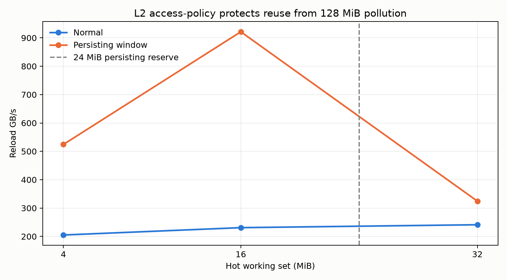
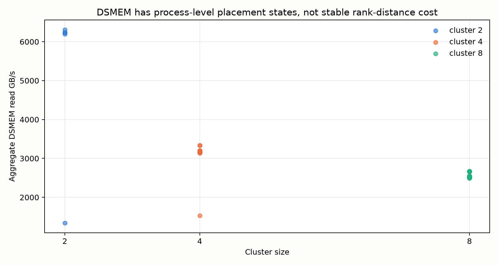
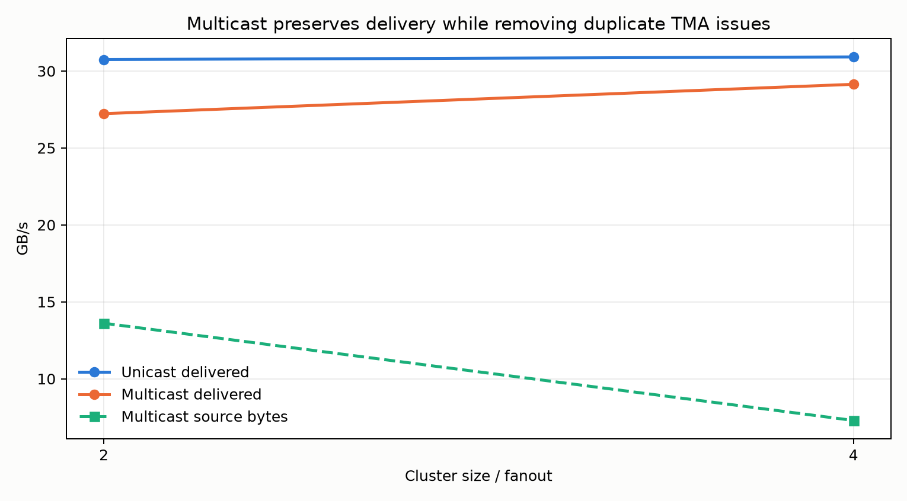

# NVIDIA Thor Bandwidth 体系结构探索：Phase 2

本报告独立记录第二阶段，不修改第一阶段结果口径。主题仍是吞吐、数据复用与互连，因此代码留在 `Bandwidth/`；依赖链和单次完成延迟仍归 `Latency/`。

## 1. L2 persistence：从容量到可控驻留

Thor 报告 32 MiB L2、24 MiB persisting reserve 和 128 MiB access-policy window。`11_l2_residency` 先预热 hot set，再用 128 MiB 流式读取污染 cache，最后只计时 hot reload。

| Hot set | Normal reload 范围 | Persisting reload 范围 | 加速范围 |
|---:|---:|---:|---:|
| 4 MiB | 159–207 GB/s | 230–529 GB/s | 1.45–2.56× |
| 16 MiB | 211–245 GB/s | 343–946 GB/s | 1.63–3.99× |
| 32 MiB | 241–252 GB/s | 310–328 GB/s | 1.25–1.35× |

多轮回归显示系统存在不同的 cache/memory 平台状态，因此保留范围而不挑单次峰值。16 MiB 完全落在 24 MiB reserve 内，收益最高；32 MiB 超过 reserve，`hitRatio` 降为 24/32，收益随之回落。这说明 access-policy window 不是提高 L2 pipe 峰值，而是保护跨 kernel reuse，减少被大流式工作集驱逐的概率。

NCU kernel replay 下 normal/persist 都接近全 L2 miss。原因是 persistence 依赖前序 kernel 建立 cache state，而 profiler replay 会控制/恢复被测 kernel 状态。这里采用普通 CUDA event 作为主证据，并将 replay 结果记录为工具限制，不能用它否定普通执行中的稳定加速。

## 2. DSMEM rank 距离与物理 placement 状态

`12_dsmem_topology` 在 cluster 2/4/8 内扫描所有 rank delta，所有 CTA 同时读取对应 peer，96 KiB dynamic shared 强制每 SM 一个 CTA。

第一个进程曾出现 cluster=4 的 `+1/+2/-1` 为 1.53/3.33/3.33 TB/s；后续进程三个方向都稳定在约 3.14–3.20 TB/s。cluster=8 的所有 delta 基本为 2.50–2.67 TB/s，没有稳定的距离衰减；cluster=2 则出现 1.34 与 6.20–6.31 TB/s 两档。

因此不能建立“rank 越远越慢”的线性拓扑模型。数据支持的是：cluster size 决定活跃 CTA/注入点数量，而进程启动时的物理 placement 或平台状态会形成离散带宽档位。rank 编号是编程模型中的逻辑编号，不应直接解释为物理 mesh 距离。

## 3. TMA bulk multicast：优化上游去重，不突破交付管线

`13_tma_multicast` 使用 `sm_110a` 的 `cp.async.bulk...multicast::cluster`。unicast 让每个 CTA 独立读取同一 1 KiB tile；multicast 只由 rank 0 发射一次并广播到 cluster mask 中所有 CTA。SASS 分别确认 `UBLKCP.S.G` 与 `UBLKCP.S.G.MULTICAST`。

| Fanout | Unicast delivered | Multicast delivered | Multicast source口径 |
|---:|---:|---:|---:|
| 2 | 30.70 GB/s | 29.17 GB/s | 14.58 GB/s |
| 4 | 30.98 GB/s | 29.14 GB/s | 7.28 GB/s |
| 8（实验性） | 24–26 GB/s | 21–23 GB/s | 2.7–2.9 GB/s |

当前 kernel 每次 transfer 后立即等待，所以绝对吞吐受控制/完成延迟限制。multicast 的价值在 source 去重：fanout=2 时 NCU 记录 unicast 524,288 条、multicast 262,144 条 TMA load，正好减半；两者的 TMA read-bytes counter 都是 512 MiB，说明该 bytes counter 位于 fan-out 后、统计 delivered bytes，而不是唯一 source fetch bytes。

连续回归中 multicast 偶发 `unspecified launch failure`。cluster=2/4 通过隔离进程并最多重试三次可稳定完成；cluster=8 曾连续三次失败，因此降为显式 `--experimental-cs8`，不进入默认正式回归。这是当前驱动 595.78 / CUDA 13.3 上的稳定性边界；成功性能不能掩盖该事实。

## 4. 已验证的边界

- NCU 报告 `generic_compression_supported=0`，本机不能建立可靠的硬件压缩带宽实验。
- 只有一张 GPU，CUDA switch multicast、P2P 与 NVLink 无法实测；cluster multicast不等同于多 GPU multicast。
- FP8/FP4 tcgen05 需要合法的 F8F6F4 descriptor、K shape 与可能的 block-scale 元数据。当前 CUTLASS 暴露相关原语，但在未完成 SASS、TC-pipe counter 和数学工作量三重验证前不报告数字。
- NCU kernel replay 不适合验证依赖前序 launch cache residency 的实验。

## 原始证据

- `results/thor-l2-residency-20260809-152317.txt`
- `results/thor-l2-residency-20260809-153516.txt`
- `results/ncu-l2-20260809-152317/`
- `results/thor-dsmem-topology-20260809-152510.txt`
- `results/thor-tma-multicast-*.txt`
- `results/ncu-multicast-20260809-153200/`
- `results/11_l2_residency.sass.txt`、`12_dsmem_topology.sass.txt`、`13_tma_multicast.sass.txt`
