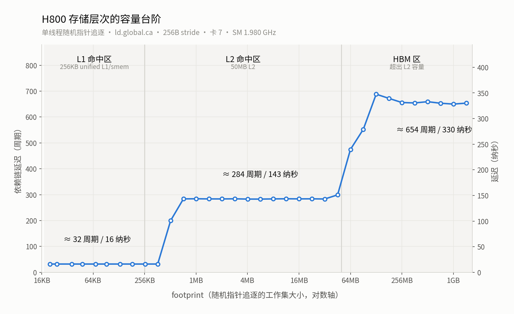
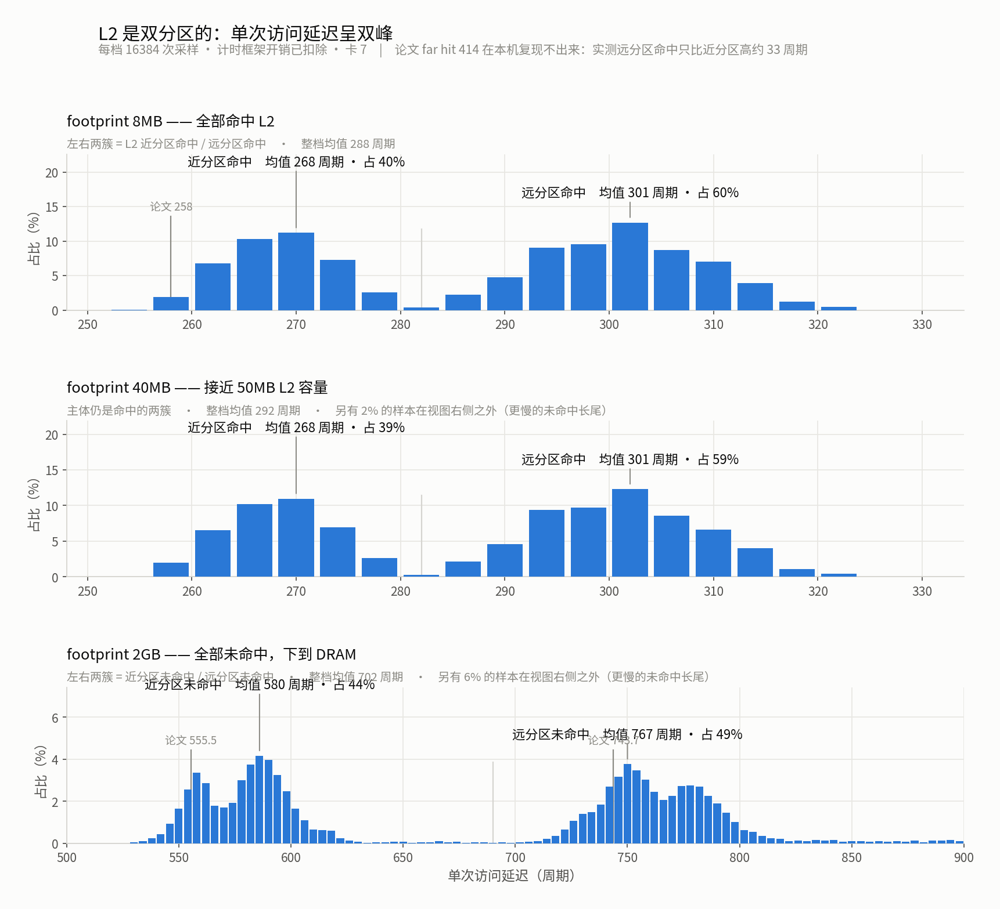
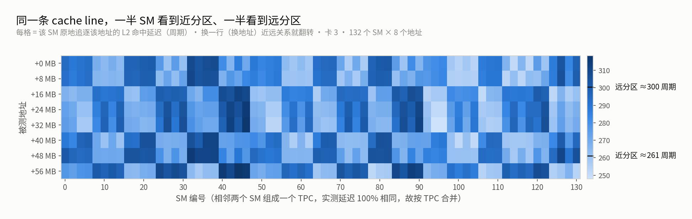

# Hopper (H800 / sm_90a) 延迟微基准套件

按**层次分类**组织。全部测量都是单线程/单 warp + 内联 PTX + 指针追逐/依赖链，每个数字都用 SASS 复核过，并配 NCU 硬件计数器与独立实现交叉验证。

```
./run.sh          # 一键全跑(单卡部分), 固定卡 3, 结果存 results/
./p2p.sh          # 跨卡 NVLink 部分, 固定卡 6->7, 附 NVLink 计数器验证
./ncu.sh          # NCU 交叉验证: 锁频复测 + 硬件计数器验证层级归属
./analyze.py      # 从延迟直方图里提取峰(L2 近/远分区)
make sass         # SASS 复核 —— 不是可选步骤, 见附录 B
python3 figures/plot.py   # 出图(数据驱动, 见 figures/README.md)
```

本机：H800 **SXM**，132 SM，50MB L2，228KB smem/SM，实测 SM 频率 **1.980 GHz**（1 周期 = 0.505 纳秒）。

## 代码结构

| 编号 | 文件 | 类别 | 内容 |
|---|---|---|---|
| 01 | `01_mem_read.cu` | **一、存储层次** | 各存储空间**读**延迟 + cache operator + 访问宽度 |
| 02 | `02_mem_write.cu` | 一、存储层次 | 各目标端**写**延迟（发射间隔 / 写→读往返 / 可见性） |
| 03 | `03_mem_levels.cu` | 一、存储层次 | 容量台阶、L2 近/远分区直方图、NCU 归属探针、独立实现对照表 |
| 03b | `03b_l2_partition.cu` | 一、存储层次 | L2 双分区的 SM ↔ 地址 映射（近/远翻转、TPC 粒度） |
| 04 | `04_mem_p2p.cu` | 一、存储层次 | 跨设备：NVLink P2P 读/写/原子（卡 6→7） |
| 05 | `05_inst.cu` | **二、指令延迟** | 标量指令：依赖链延迟 vs 发射间隔 |
| 06 | `06_tensor.cu` | 二、指令延迟 | tensor core：`mma.sync` / `wgmma` |
| 07 | `07_sync.cu` | **三、同步与一致性** | barrier / fence / mbarrier / 原子 |
| 08 | `08_async_copy.cu` | **四、异步数据搬运** | `cp.async` / TMA 双向 |
| — | `common.cuh` | 基础设施 | 测量框架：双点斜率法、Sattolo 链、哨兵 |
| — | `dsmem.cuh` | 基础设施 | DSMEM（cluster 跨 SM）读/写三模式 + cluster 启动器 |
| — | `figures/` | 图表 | 三张图 + 生成脚本 + 原始 CSV，见 [`figures/README.md`](figures/README.md) |

---

# 总览：一张表建立数量级概念

从快到慢，全部本机实测（周期 @ 1.98 GHz）：

| 层级 / 操作 | 周期 | 纳秒 | 相对 FFMA |
|---|---|---|---|
| FFMA / FADD / FMUL / SHF / LOP3 / PRMT / HADD2 / **DPX** 依赖链 | **4.1** | 2.1 | 1× |
| `mov %clock64` | 7.3 | 3.7 | 1.8× |
| FP64 DADD / DFMA 依赖链 | 8.1 | 4.1 | 2× |
| `membar.cta`（`__threadfence_block`） | 8.3 | 4.2 | 2× |
| 64 位乘加 `mad.lo.s64` | 13.2 | 6.7 | 3.2× |
| `barrier.sync`（`__syncthreads`，1 warp） | 14.2 | 7.2 | 3.5× |
| POPC | 17.0 | 8.6 | 4.1× |
| MUFU `sin` / `sqrt` / `rcp` | 23 / 39 / 41 | 12 / 20 / 21 | 6~10× |
| **shared memory 读** | **23.0** | 11.6 | 5.6× |
| `mma.sync.m16n8k16` 依赖链 | 24.2 | 12.2 | 5.9× |
| warp shuffle `SHFL` | 26.0 | 13.1 | 6.3× |
| shared 写→读往返 | 28.0 | 14.1 | 6.8× |
| **L1 命中** | **32.0** | 16.2 | 7.8× |
| DSMEM 自读（走 DSM 接口） | 32.2 | 16.3 | 7.9× |
| shared 原子 `atom.shared.add` | 33.5 | 16.9 | 8.2× |
| **local memory 读**（栈溢出 LDL） | 34.0 | 17.2 | 8.3× |
| TMA smem→global 写完成（128B, `wait.read`） | 34.4 | 17.4 | 8.4× |
| L1 写→读往返 | 41.1 | 20.7 | 10× |
| `redux.sync` warp 归约 | 44.1 | 22.3 | 11× |
| `mbarrier.arrive` + `try_wait` | 46.3 | 23.4 | 11× |
| `wgmma.m64n8k16` 完成（累加器立即可用） | 54.6 | 27.6 | 13× |
| **常量内存读**（下标数据相关） | 58.6 | 29.6 | 14× |
| `barrier.cluster` arrive.**relaxed** + wait（2 CTA） | 70.7 | 35.7 | 17× |
| **DSMEM 对端读（cluster=2，跨 SM）** | **180.8** | 91.3 | 44× |
| **global 原子**（近分区 / 远分区） | **263 / 510** | 133 / 257 | 64× / 124× |
| **L2 命中** | **272** | 137 | 66× |
| L2 写→读往返 | 294 | 148 | 72× |
| `cp.async` 端到端（L2，立即等） | 306 | 155 | 74× |
| TMA global→smem 端到端（L2） | 324 | 163 | 79× |
| `membar.gl`（`__threadfence`） | 663 | 335 | 162× |
| **HBM 读** | **681** | 344 | 166× |
| **HBM 写→读往返**（write-allocate） | **738** | 373 | 180× |
| `barrier.cluster` arrive.**release** + wait（**默认语义**） | **752** | 380 | 183× |
| `st.cg + membar.gl → ld.cg` | 928 | 469 | 226× |
| **`st.release.gpu → ld.acquire.gpu`** | **958** | 484 | 233× |
| **远端 HBM 读（NVLink，卡 6→7）** | **1680** | 849 | 410× |
| 远端写→读往返（NVLink） | 1788 | 903 | 436× |
| 远端原子（NVLink） | 1835 | 927 | 447× |
| **host pinned 读**（zero-copy 经 PCIe） | **2514** | 1270 | 613× |
| `membar.sys`（`__threadfence_system`） | 3085 | 1558 | 752× |
| **跨卡传标志 `st.release.sys → ld.acquire.sys`** | **4962** | **2507** | 1210× |


值得记住的比例：**smem ≈ 6× FFMA，L1 ≈ 8×，DSMEM 跨 SM ≈ 44×，L2 ≈ 66×，HBM ≈ 166×，NVLink 远端 ≈ 410×，host 内存 ≈ 610×，跨卡传标志 ≈ 1200×。**

⚠️ **"写"在这张表里出现两次且含义完全不同**：写的**发射间隔**只有 4~8 周期且与写到哪里无关（store 是 posted 的），而**写→读往返**才是该层级读延迟 + 5~57。优化时要先分清你受哪个约束。

---

# 第一类：存储层次的读与写

## 1.1 读延迟矩阵（`01_mem_read`）

全部用指针追逐：节点里存的就是下一个节点的**地址**，依赖链上只有一条 load，没有任何地址计算。SASS 确认为 `LDG.E.64.STRONG.GPU R6,[R6.64]` / `LDS R5,[R5]` / `LDL` / `LDC`。

| 存储空间 | 周期 | 纳秒 | 备注 |
|---|---|---|---|
| **shared memory**（LDS） | **23.00** | 11.62 | |
| **DSMEM 自读**（走 DSM 接口） | **32.19** | 16.26 | |
| **L1 命中**（24KB, `.ca`） | **32.00** | 16.16 | |
| **local memory**（LDL, 2KB 栈溢出） | **34.02** | 17.18 | 背后是 L1/L2 |
| **常量内存**（8KB, LDC + 寄存器偏移） | **58.64** | 29.62 | 下标数据相关 → 非 uniform 路径 |
| **DSMEM 对端**（cluster=2, 跨 SM） | **180.84** | 91.34 | |
| **L2 命中**（32MB, `.cg`） | **271.96** | 137.35 | |
| **HBM**（2GB, `.cg`） | **681.34** | 344.11 | |
| **host pinned**（32MB, zero-copy 经 PCIe） | **2514** | 1270 | |

**常量内存 58.6 比 L1 还慢一倍**：常量内存只有在下标 **warp-uniform**（编译期常量或 uniform 寄存器）时才走那条极快的立即常量缓存；这里是数据相关下标，走 `LDC c[..][Rx]`。**用 `__constant__` 存按线程变化的查表，性能不如 shared。**

### cache operator 对读延迟的影响（同一 32MB footprint）

| operator | 周期 | 说明 |
|---|---|---|
| `.ca` 经 L1 / `.cg` 绕过 L1 | 271.95 / 271.92 | |
| `.cs` streaming | 277.04 | |
| **`.lu` last-use** | **333.21** | +22%：提示"用完即弃"→ 行被提前淘汰，后续 miss 变多 |
| `.cv` 不缓存强制重取 | 271.90 | ⚠️ 在 sm_90 上**并不绕过 L2** |
| `.nc` 非一致（`__ldg`） | 271.96 | |
| `relaxed.gpu` / `relaxed.sys` | 271.93 / 271.95 | 作用域不影响命中延迟 |

**cache operator 对命中延迟基本没影响（唯一例外是 `.lu`）**，它们影响淘汰策略和带宽，不是延迟。另外 `.cv` 不能用来强制读 DRAM。

### 访问宽度

| 宽度 | 周期 |
|---|---|
| 64-bit（`LDG.E.64`） | 271.96 |
| 128-bit（`LDG.E.128`） | 271.93 |

**加宽访问不增加延迟** → 向量化读是免费的（只影响带宽和事务数）。

## 1.2 写延迟矩阵（`02_mem_write`）

"写延迟"必须先说清测的是哪一个 —— store 本身是 posted（fire-and-forget）的，三种定义的数值能差 90 倍。

### (1) 发射间隔 —— 不等完成，16 个独立地址

| 写到哪里 | 发射间隔 | 纳秒 |
|---|---|---|
| → shared memory（STS） | **4.14** | 2.09 |
| → local memory（STL） | 4.12 | 2.08 |
| → DSMEM 对端（跨 SM） | 4.69 | 2.37 |
| → L1（24KB, `st.wb`） | **8.11** | 4.10 |
| → L2（32MB, `st.cg`） | **8.11** | 4.10 |
| → HBM（1GB, `st.cg` / `st.wt` / `st.cs`） | **8.11** | 4.10 |
| → host pinned（经 PCIe） | **8.11** | 4.10 |
| → 远端显存（NVLink，见 1.4） | **8.11** | 4.10 |

**本套件最反直觉的一条：写的发射间隔与"写到哪里"完全无关。** 片上（smem/local/DSMEM）约 4 周期，一切 global 目标 —— L1、L2、HBM、PCIe 上的 host 内存、甚至 NVLink 另一头的另一张卡 —— 一律 **8.11 周期**。因为 store 是 posted 的：交给写缓冲就算完事，目标端的真实代价被完全隐藏。**只要不马上读回来，写到 HBM 和写到 L2 一样便宜。**

### (2) 写→读往返 —— 生产者写完到消费者读到

| 写到哪里 | 周期 | 纳秒 | 对比纯读 |
|---|---|---|---|
| shared: `STS → LDS` | **28.00** | 14.14 | 纯读 23.0 → **+5** |
| L1: `st.wb → ld.ca` | **41.05** | 20.73 | 纯读 32.0 → **+9** |
| DSMEM 对端: `ST → LD` | **176.50** | 89.14 | 纯读(追逐) 180.8 |
| L2: `st.cg → ld.cg` | **293.89** | 148.43 | 纯读 272.0 → **+22** |
| **HBM: `st.cg → ld.cg`** | **738.30** | 372.88 | 纯读 681.3 → **+57** |
| host pinned: `relaxed.sys` | **2496** | 1260 | 经 PCIe 往返 |

**规律：写→读往返 ≈ 该层级的读延迟 + 5~57 周期。** 写本身几乎不额外花钱，贵的永远是"读回来"那一趟。

HBM 那行的 738 解释得通：写一个不在 L2 的行要先 **write-allocate** 从 DRAM 取回整行（≈681），再读到就是 738。

> **怎么测出真正的 HBM 写→读往返**：固定地址的往返一定落在 L2（`.cv` 不绕过 L2），所以必须每次换全新随机行 —— A 区(1GB)指针追逐给出随机地址，B = A + 1GB 处做 `st→ld`。**但 B 的地址只依赖 A 的读结果，下一次 A 读并不等 B 往返，两条链默认是并行的，直接测会得到 `max()` 而不是和**（第一版算出 82 周期，低于 HBM 读延迟，物理上不可能）。解法是用一个"运行时为 0、编译期未知"的掩码把 B 的结果异或回 `p`，强制串成一条链，再减掉同 ALU 开销的基线：1430.93 − 692.63 = **738.30**。

### (3) 可见性代价

| | 周期 | 纳秒 |
|---|---|---|
| `st.release.gpu → ld.acquire.gpu` | **957.65** | 483.66 |
| `st.cg + membar.gl → ld.cg` | 927.93 | 468.65 |

同样是 L2 上的一次写→读，普通 `st.cg→ld.cg` 只要 294，**加上跨 SM 可见性语义就涨到 958（3.3 倍）**。论文 `[p2]` 报"经 global 一存一取 = 956 周期"，与此吻合。

## 1.3 容量台阶与分区结构（`03_mem_levels`）

### footprint 扫描：容量层次直接读出来



上图是 34 个 footprint 点（√2 步长）的实测曲线，两条竖线是 L1（256KB）与 L2（50MB）的容量边界 —— **台阶的位置和硬件容量严丝合缝**。三个平台的数值：

```
  32 KB ~ 256 KB    32 周期    <- L1 (Hopper 256KB unified L1/smem, 台阶正好落在 256KB)
     512 KB        190 周期    <- 过渡
   1 MB ~  32 MB   272 周期    <- L2 (50MB)
      64 MB        481 周期    <- 过渡(刚超 L2, 部分命中) ※ 正好是 p1 报的 478.8
 128 MB ~ 2 GB   640~676 周期  <- HBM
```

`[p1]` 报的 global memory 478.8 恰好落在"刚超出 L2"的过渡区，`[p2]` 修正为 656。**测 HBM 延迟 footprint 一定要远大于 L2**，否则测到的是混合值。

### L2 近/远分区：单次访问延迟直方图



三档 footprint 各采样 16384 次单次访问。**双峰结构一眼可见**：左簇是近分区、右簇是远分区。2GB 那档的两簇中心（近 580 / 远 767）与论文的 near miss 555.5 / far miss 743.7 基本重合（图中细线标出了论文值）。

| footprint | 实测峰 | 论文 `[p2 T4]` |
|---|---|---|
| 8MB | **266（60%）/ 297（40%）** | near hit 258 / far hit 414 |
| 40MB | 266 + 296~300（主体）；部分运行还会出现 453 / 483 / 544 / 630 的 miss 组 | near hit / near miss 555.5 / far miss 743.7 |
| 2GB | **550 + 587（44%）/ 746 + 843（47%）** | near miss 555.5 / far miss 743.7 |

- **2GB 的双峰和论文几乎完全对上**（550 ↔ near miss 555.5；746 ↔ far miss 743.7）—— L2 双分区在 miss 路径上被清晰复现。
- **但 8MB 的 far hit 只比 near hit 高 ~30 周期，论文是 +156**（258→414）。这条复现不出来，建议以自测为准。
- 40MB 那一档的 miss 组占比随运行波动（取决于 L2 里的实际驻留情况），不是稳定特征。

### L2 双分区到底是什么：SM ↔ 地址 的映射（`03b_l2_partition`）

上面直方图看到的双峰，机制是这样的 —— **50MB L2 不是一整块，而是分成两半贴在 die 的两个半区上，中间由片上互连连接**：

```
        ┌─────────────── H800 die ───────────────┐
        │   半区 A              │    半区 B      │
        │  ┌──────────┐        │   ┌──────────┐  │
        │  │ SM 群 A  │        │   │ SM 群 B  │  │
        │  └────┬─────┘        │   └────┬─────┘  │
        │  ┌────┴─────┐  互连   │   ┌────┴─────┐  │
        │  │ L2 分区A │◄═══════►│  │ L2 分区B │  │
        │  │  ~25MB   │        │   │  ~25MB   │  │
        │  └────┬─────┘        │   └────┬─────┘  │
        │   HBM 通道           │    HBM 通道     │
        └────────────────────────────────────────┘
```

两条规则：
1. **一个物理地址只归属一个分区**（按物理地址哈希决定），不会两边都存。
2. **一个 SM 只在一个半区里**。访问自己那半的分区叫 **near**，访问对面那半叫 **far**，后者要多走一趟互连。

所以「L2 命中」其实是两件不同的事。这个模型给出一个可验证的推论：**同一个地址，一半 SM 看到近、另一半看到远；换个地址，近/远关系翻转。**



测法：让每个被测地址里**存自己的地址**，于是 `ld.global.cg.u64 %p,[%p]` 就是在原地追逐这一条 cache line，测的是纯 L2 命中延迟；每次启动 132 个 block，**只有落在目标 SM 上的那个做测量、其余立刻退出**，所以测量期间零竞争（第一版用全局票号排队，131 个自旋的 block 会给正在测量的那个添噪声）。

| 被测地址 | 近簇（周期） | 远簇（周期） | 远−近 | 近/远 SM 数 |
|---|---|---|---|---|
| +0 MB | 259.0 | 298.5 | 39.5 | 62 / 70 |
| +8 MB | 259.9 | 299.0 | 39.1 | 68 / 64 |
| +16 MB | 261.2 | 299.1 | 37.9 | 62 / 70 |
| +24 MB | 261.4 | 300.4 | 39.0 | 72 / 60 |
| +32 MB | 260.1 | 301.0 | 40.8 | 77 / 55 |
| +40 MB | 260.8 | 299.8 | 39.0 | 74 / 58 |
| +48 MB | 266.0 | 304.2 | 38.3 | 68 / 64 |
| +56 MB | 259.0 | 307.4 | 48.4 | 64 / 68 |

四条实测结论：

**① 近/远不是 SM 的固有属性，而是 (SM, 地址) 这一对的属性。** 132/132 个 SM 在这 8 个地址上都同时出现过近和远。举例（`·`=近，`#`=远）：

| | +0MB | +8MB | +16MB | +24MB | +32MB | +40MB | +48MB | +56MB |
|---|---|---|---|---|---|---|---|---|
| SM 0 | `#`294 | `#`292 | `·`267 | `·`274 | `·`275 | `#`288 | `#`301 | `·`278 |
| SM 6 | `#`293 | `#`293 | `·`268 | `·`261 | `·`258 | `#`299 | `#`296 | `·`280 |
| SM 12 | `·`268 | `·`266 | `#`290 | `#`284 | `#`281 | `·`271 | `·`271 | `#`302 |

SM 0 和 SM 12 在每一列上都恰好相反 —— 它们在 die 的两个不同半区。

**② 决定远近的粒度是 TPC（2 个 SM），不是单个 SM。** 相邻 SM 对 `(2k, 2k+1)` 延迟相同（差 <1.5 周期）的比例是 **528/528 = 100%**。Hopper 的 2 个 SM 组成一个 TPC，共享同一条到 L2 的路径。所以热力图按 TPC 合并画，宽度减半而信息不丢。

**③ 不是干净的两级台阶。** 主结构是双分区（±39 周期），但同组内还有约 ±16 周期的额外离散，说明在双分区之上还叠加了 GPC 位置带来的距离差。图 2 那两个簇各自有宽度，也是这个原因。

**④ 映射取决于具体的物理分配，不能硬编码。** 同一个程序连跑两次（分配器很可能还回同一批物理页）分类 100% 一致；但**在被测 buffer 前面先占掉一点显存**，分类就变了：

| 先占掉 | 与不占时的分类一致率 |
|---|---|
| 0 MB | 100% |
| 3 MB | 59.3% |
| 7 MB | 61.0% |
| 64 MB | 38.6% |

即"buffer 内偏移 +16MB 是近还是远"这件事，取决于这个 buffer 落在哪些物理页上。

### 对写代码的三条实际影响

1. **别把 L2 延迟当一个数用。** 272 只是两簇的加权平均，真实值在 259~307 之间取决于地址落在哪一半。做延迟预算时按远的算更稳。
2. **单地址的 L2 级测量必须采样多个地址**，否则你拿到的是近或远中的一个，而且不知道是哪个。这就是本套件踩过的第 11 个坑：同一个原子操作在不同 buffer 上测出 264 和 472，两个都"对"。
3. **满载 kernel 里躲不开远分区。** 一个 kernel 铺满 132 个 SM 时，任何一条 cache line 都有约一半的 SM 属于"远"，这是架构决定的下限，不是调代码能规避的。真正能优化的是**减少跨越次数**（提高数据在近侧的复用），而不是"让所有访问都变近"。

### 独立实现交叉校验

`03_mem_levels --core` 是与 `01_mem_read` **完全独立写的另一套 kernel**（自带一份测量框架，故意保持自包含）。同一批量的结果：

| 量 | `01_mem_read` | `03_mem_levels` | |
|---|---|---|---|
| shared memory | 23.00 | 23.00 | 逐位相同 |
| L1 命中 | 32.00 | 32.00 | 逐位相同 |
| L2 命中 | 271.96 | 271.91 | 差 0.02% |
| HBM | 681.34 | 680.96 | 差 0.06% |

## 1.4 跨设备：NVLink 与 PCIe（`04_mem_p2p`，卡 6→7）

本机任意两卡都是 `NV18`（18 条 NVLink 经 NVSwitch，每条 26.562 GB/s）。**这组测量用卡 6（计算）+ 卡 7（内存），不是主套件的卡 3。**

### 最反直觉的发现：远端的行会进本地 L1，但不进本地 L2

| footprint | 本地（6 读 6） | **远端（6 读 7）** |
|---|---|---|
| 24KB | 32.00 周期 | **32.00 周期** |
| 32MB | 276.1 周期 | **1680.3 周期** |
| 2GB | 684.4 周期 | **1704.6 周期** |

24KB 远端 footprint 读出来 **32.00 周期，和本地 L1 命中逐位相同**；但 32MB（明明小于 50MB L2）是 1680，和 2GB 的 1704 几乎一样 —— **压根没进 L2**。

**实践含义：跨卡访问的热点数据要小到能待在 L1（每 SM 256KB）才有缓存红利，否则每次都付全额 NVLink 延迟。**

> 这个结论太反直觉，所以做了两道验证：① `cudaPointerGetAttributes` 确认三条远端链**确实都在 GPU 7 上**；② **NVLink 硬件计数器**在整轮 benchmark 前后的 **Rx 增量 213 MiB**，证明远端读真的经 NVLink 取回了数据（`p2p.sh` 每次都打印这个增量）。

### 读 / 写 / 原子

| | 本地 | **远端（NVLink）** | 倍数 |
|---|---|---|---|
| 读（32MB 追逐） | 276.1 | **1680.3** / 849 纳秒 | 6.1× |
| 写发射间隔 | 8.11 | **8.11** | **1×** |
| `st.cg → ld.cg` 往返 | 319.2 | **1787.8** / 903 纳秒 | 5.6× |
| `atom.global.add.u32` | 341.5 | **1834.6** / 927 纳秒 | 5.4× |
| `atom.global.cas.b32` | — | 1806.7 / 913 纳秒 | |
| **`st.release.sys → ld.acquire.sys`** | — | **4962.4** / **2507 纳秒** | |

**跨卡传一个标志位要 4962 周期 ≈ 2.5 微秒** —— 是普通远端往返（1788）的 2.8 倍、本地 L2 往返（319）的 15.5 倍。多卡 spin-wait 同步的开销基本全在这里；跨卡原子/锁要按微秒级预算。

**cache operator 对远端完全无效**：`.ca / .cg / .cv / .nc / relaxed.gpu / relaxed.sys` 六种写法全在 1679.2~1680.0，差异 <0.05%。远端读的延迟完全由 NVLink 决定。

### 方向对称性与跨层级对照

6→7 = 1680.7，7→6 = 1690.5，差 0.6%，NVSwitch 拓扑下方向对称。

| 访问对象 | 读延迟(周期) | 纳秒 | 相对本地 HBM |
|---|---|---|---|
| 本地 L2 | 276 | 139 | 0.4× |
| **本地 HBM** | **684** | **346** | **1×** |
| **远端 HBM（NVLink）** | **1680** | **849** | **2.5×** |
| **host pinned（PCIe）** | **2514** | **1270** | **3.7×** |

NVLink 比本地 HBM 慢 2.5×，但比 PCIe 走 host 内存**快 1.5×**。

---

# 第二类：指令延迟

## 2.1 标量指令（`05_inst`）

这是两件不同的事，混淆会导致完全错误的优化判断：
- **依赖链延迟**（ILP=1）：后一条指令依赖前一条的结果 → 流水线深度。
- **发射间隔**（ILP=8）：8 条互不依赖的指令轮流发 → 单位吞吐。
- **需要 ILP = 延迟 / 发射间隔**：想填满这条流水线，代码里得有多少路独立计算。

| 指令 | 延迟(周期) | 发射(周期) | 需要ILP | 公开参考值 |
|---|---|---|---|---|
| SHF funnel shift（ALU） | 4.11 | 2.09 | 2.0 | 4（Volta 以来） |
| LOP3 bitwise 3-in（ALU） | 4.11 | 2.09 | 2.0 | |
| IMAD `mad.lo.s32` | 4.11 | 2.07 | 2.0 | |
| PRMT 字节重排 | 4.11 | 2.09 | 2.0 | |
| **DPX `__viaddmax_s32`**（VIADDMNMX） | **4.11** | 2.04 | 2.0 | 论文只有图，无数值 |
| **DPX `__vimax3_s32`**（VIMNMX3） | **4.11** | 2.04 | 2.0 | 同上 |
| FADD / FMUL | 4.11 | 1.10 | 3.7 | |
| **FFMA `fma.rn.f32`** | **4.11** | **1.10** | **3.7** | |
| HADD2 `add.f16x2` | 4.11 | 2.07 | 2.0 | |
| DADD / DFMA（FP64） | 8.08 | 2.09 | 3.9 | |
| IMAD64 `mad.lo.s64` | 13.22 | 8.22 | 1.6 | |
| POPC | 17.00 | 8.07 | 2.1 | |
| MUFU `sin` / `sqrt` / `rcp`（SFU） | 22.97 / 39.11 / 41.33 | 8.3 / 8.4 / 9.3 | 2.8 / 4.7 / 4.5 | |
| SHFL `shfl.sync.idx.b32` | 26.00 | 4.47 | 5.8 | |
| REDUX `redux.sync.add.s32` | 44.05 | 11.48 | 3.8 | 未测 |

**发射间隔与硬件配置严格自洽**，这是这批数据可信的独立证据 —— sm_90 每个 SM 分区有 32 FP32 / 16 INT32 / 16 FP64 / 4 SFU：

| 单元 | 每分区 lane | 理论 warp 指令间隔 | 实测 |
|---|---|---|---|
| FP32 FMA | 32 | 32/32 = 1 | **1.10** ✅ |
| INT32 / ALU | 16 | 32/16 = 2 | **2.04~2.09** ✅ |
| FP64 | 16 | 32/16 = 2 | **2.09** ✅ |
| SFU（MUFU） | 4 | 32/4 = 8 | **8.3~9.3** ✅ |

实用结论：
- **FFMA 延迟 4 / 间隔 1 → 至少要 4 路 ILP** 才能填满 FP32 流水线（或靠多 warp 并发覆盖）。
- **整数运算吞吐只有 FP32 的一半**（每分区 16 vs 32 lane）。地址计算、循环控制、索引运算都吃这条管道 —— 很多 kernel 的隐形瓶颈。
- **64 位整数乘加 13.2 周期 / 间隔 8.2**，是 32 位的 3~4 倍。索引尽量用 32 位。
- **DPX 等于白送**：三输入的 `add+max` 压成一条指令，延迟和发射间隔与一条普通整数运算**完全相同**。替代 `max(a+b,c)` 的两条指令是纯赚。DPX 在 PTX 里没有助记符，只有 C 内建函数，nvcc 直接下译到 SASS。
- **`redux.sync` 44 周期完成整个 warp 求和**，手写 5 次 `shfl` 要 5×26 = 130 周期 —— 快 3×。
- FP16x2 的延迟和 FP32 一样，间隔却慢一倍 —— 纯 `add.f16x2` 不走 tensor core，别指望标量 fp16 有吞吐优势。

## 2.2 tensor core（`06_tensor`）

| | 周期 | 纳秒 | 公开参考值 |
|---|---|---|---|
| **`mma.sync.m16n8k16.f32.f16.f16.f32`**（1 warp） | **24.17** | 12.21 | **24.1** `[p1 T7]` ✅ |
| `wgmma.m64n8k16` RS 连发（128 线程） | 54.61 | 27.58 | LAT(RS)=13.0 `[p1 T10][p2 T11]` |
| `wgmma.m64n8k16` RS 每条 commit+wait | 54.61 | 27.58 | |
| `wgmma.m64n8k16` RS 4 组独立累加器 | 54.23 | 27.39 | |

`mma.sync` 的 **24.17 vs 论文 24.1**，几乎完全一致。

但 `wgmma` 三种写法都是 54.6，与论文的 13.0 差 4 倍。SASS 给出原因：**`HGMMA : WARPGROUP.DEPBAR = 17 : 17`，ptxas 在每条 HGMMA 后面都插了一条 depbar** —— 因为内联汇编里累加器是 `"+f"`（读写）操作数，ptxas 必须保证前一条异步 MMA 完成后才能再读那些寄存器，即使换成 4 组互不相关的累加器也一样。所以 **54.6 是"累加器立即可用"的完成延迟**，论文的 13.0 应该是流水线化（`wait_group N`，N>0，多组重叠）下的发射率 —— 那种模式没法用内联汇编表达而不破坏寄存器依赖。**两个数测的不是同一件事。**

---

# 第三类：同步与一致性（`07_sync`）

## 屏障与栅栏

| | 周期 | 纳秒 |
|---|---|---|
| `barrier.sync`（`__syncthreads`，1 warp 无等待） | **14.16** | 7.15 |
| `membar.cta`（`__threadfence_block`） | 8.25 | 4.17 |
| **`membar.gl`（`__threadfence`）** | **663.34** | 335.02 |
| **`membar.sys`（`__threadfence_system`）** | **3084.73** | 1557.94 |
| `mov %clock64` | 7.30 | 3.69 |

**`__syncthreads()` 只要 14 周期，比想象中便宜；但 `__threadfence()` 要 663（贵 47 倍），`__threadfence_system()` 要 3085（贵 218 倍）。** 栅栏的作用域每升一级，代价涨一个数量级。

## cluster 与异步屏障

| | 周期 | 纳秒 |
|---|---|---|
| `mbarrier.arrive` + `try_wait`（无实际等待） | 46.28 | 23.37 |
| `barrier.cluster.arrive.**relaxed**` + wait（2 CTA） | **70.73** | 35.72 |
| `barrier.cluster.arrive.**release**` + wait（2 CTA） | **751.57** | 379.58 |

**这里有个 10.6 倍的坑：`barrier.cluster.arrive` 不写修饰符就是 `.release`**，SASS 里会插一条 `MEMBAR.ALL.GPU`。751 − 70.7 ≈ 681，正好等于单独一条 `membar.gl`（663）。**cluster 内只做执行同步、不需要内存序时，一定显式写 `.relaxed`。**

## 原子操作

| | 周期 | 纳秒 |
|---|---|---|
| `atom.shared.add.u32` | **33.48** | 16.91 |
| `atom.global.add.u32` | 264.19 | 133.43 |
| `atom.global.cas.b32` | 271.21 | 136.98 |
| `atom.global.exch.b32` / `min.u32` | 264.18 / 264.20 | 133.4 |
| **`red.global.add.u32`**（无返回值） | **6.64** | 3.35 |
| `red.shared.add.u32`（无返回值） | 4.89 | 2.47 |

**不需要返回值时一定用 `red`（或丢弃 `atomicAdd` 的返回值）：6.64 vs 264 周期，差 40 倍。** 因为 `atom` 要等旧值回来（一次完整往返），`red` 是 fire-and-forget。

CAS 只比 add 贵 7 周期 —— 锁的代价几乎全在往返上，不在操作类型上。热点计数器要先在 smem 里聚合（33 周期）再落 global。

### ⚠️ 原子延迟随地址变化近 2 倍

L2 是双分区的（近 258 / 远 414 周期），**一个固定地址只会落在一边**：

| 地址偏移 | 0MB | 8MB | 16MB | 24MB | 32MB | 40MB | 48MB | 56MB |
|---|---|---|---|---|---|---|---|---|
| `atom.global.add` | 507.2 | 267.0 | 445.6 | 471.2 | 264.2 | 263.0 | 509.6 | 497.4 |

**最小 263.0，最大 509.6，相差 1.94 倍。** 这解释了为什么在不同 buffer 上测同一个原子操作能得到差一倍的结果（本套件重构前后就出现过 472 vs 264）。**任何单地址的 L2 级延迟测量都必须采样多个地址，或者说明落在哪个分区。**

---

# 第四类：异步数据搬运（`08_async_copy`）

异步拷贝的"延迟"定义为**端到端**：发射 + commit + wait + 数据真的可用。做法仍是指针追逐（把 `[p]` 处 16B 搬到 smem，等完成，再从 smem 读出下一个地址），这样与普通 `ld.global` 追逐在同一 footprint 下**直接可比**。

## 异步读

| | 周期 | 纳秒 | 公开参考值 |
|---|---|---|---|
| **[L2] 普通 `ld.global.cg` 追逐**（基准） | 271.9 | 137.3 | 263.0 `[p1 T4]` |
| [L2] `ld.global → st.shared → ld.shared`（同步等价） | **301.9** | 152.5 | |
| [L2] `cp.async .ca` 16B 端到端 | **305.9** | 154.5 | 论文未测延迟 |
| [L2] `cp.async .cg` 16B / `.ca` 8B | 305.9 / 305.9 | 154.5 | |
| **[L2] TMA `cp.async.bulk` g→s**（含 mbarrier） | **323.6** | 163.4 | "比常规访存 +170" `[p2 §5.1]` |
| [HBM] 普通追逐（基准） | 683.3 | 345.1 | 656 `[p2 T3]` |
| [HBM] 同步等价路径 | 709.1 | 358.1 | |
| [HBM] `cp.async .cg` 16B | **711.1** | 359.2 | |
| **[HBM] TMA g→s** | **729.4** | 368.4 | |

1. **只要你立刻等它，`cp.async` 没有任何延迟优势** —— 306 vs 同步等价路径 302，只差 4 周期。`cp.async` 的价值 100% 在于"不等"（让访存与计算重叠）。**代码里 `cp.async` 后面紧跟 `wait_group 0` 等于白写。**
2. **TMA 只比常规访存贵 52 周期**（323.6 − 271.9），HBM 上是 46。若与同步等价路径比只贵 22。**这与论文 `[p2 §5.1]` 的 "+170 周期" 差距很大** —— 论文没给绝对值（只有 Fig.2），他们的测法包含更多同步步骤，我这里是 mbarrier `arrive.expect_tx` + `try_wait` 的最小路径。**建议以自测为准。**
3. 拷贝宽度（8B/16B）和 `.ca`/`.cg` 对端到端延迟没有影响。

## 异步写

| | 周期 | 纳秒 |
|---|---|---|
| **TMA s→g 128B 发射间隔**（只发不等） | **6.16** | 3.11 |
| TMA s→g 128B + commit + `wait_group.read`（smem 可复用） | **34.38** | 17.36 |
| TMA s→g 128B + commit + `wait_group`（完全完成） | **45.20** | 22.83 |
| `cp.async .cg` 16B 连发（受在飞上限限制） | 45.54 | 23.00 |

**一条 TMA 写 128B 只要 6.16 周期发射**，比普通 8B `st.global`（8.11）还便宜 —— 搬 16 倍的数据、成本更低。等它完成才要 34~45 周期，而 `.read`（只保证 smem 可以覆盖）比完全完成早 11 周期。

---

# 附录 A：方法论

1. **纯指针追逐**：链表节点存的就是下一个节点的**地址**，依赖链上只有一条 load，没有任何地址计算。
2. **单 thread / 单 warp 单 block**：排除带宽、MSHR 排队、warp 并发干扰，测的是纯延迟。（**满载下的延迟退化还没测** —— 见附录 D。）
3. **Sattolo 算法**生成覆盖整个 buffer 的**随机单环** + 跨 cacheline stride → 硬件预取彻底失效。
4. **双点斜率法**：在 n 与 4n 两点各取 7 次最小值再求斜率，`clock64` 读取开销、循环控制、kernel 启动全部差分消掉。
5. **周期→纳秒用实测频率**：同一 kernel 内同时读 `%clock64` 和 `%globaltimer` 算真实频率，不用 nominal 值。这也让脚本能自己检测 NCU 锁频是否生效。
6. **层级隔离靠 cache operator**：`.ca`→`LDG.E.64.STRONG.SM`（经 L1），`.cg`→`LDG.E.64.STRONG.GPU`（绕过 L1），再由 NCU 计数器验证。
7. **自动哨兵**：依赖链延迟 < 1 周期、或往返延迟低于对应单程，一律打印警告。附录 B 的坑全是被哨兵抓出来的。

## NCU 交叉验证（`./ncu.sh`）

### 锁频不变性 —— 最强的正确性证据

`ncu --clock-control base` 把 SM 锁到 1.590 GHz（脚本自己用 `%clock64`/`%globaltimer` 实测确认锁频生效）：

| 层级 | 1.980 GHz | 1.590 GHz | |
|---|---|---|---|
| SHF / IMAD / FFMA | 4.14 / 4.14 / 4.11 | 4.14 / 4.14 / 4.11 | **逐位相同** |
| shared memory | 23.00 | 23.00 | **逐位相同** |
| DSMEM 自读 | 32.19 | 32.19 | **逐位相同** |
| L1 | 32.00 | 32.00 | **逐位相同** |
| L2 | 271.94 | 243.05 | −10.6% |
| HBM | 682.13 | 576.27 | −15.5% |

片上（SM 时钟域）的周期数在两个不同频率下**完全一致** → 测量没有噪声、没被时钟波动污染。L2/HBM 随频率变化是**物理事实**（跨时钟域），不是误差 —— 这也解释了本机 HBM 681 vs 论文 656 的差异（论文的 H800 PCIe 最高 1755 MHz，本机 SXM 1980 MHz）。**报 L2/HBM 延迟必须同时报频率。**

### 层级归属验证 —— 证明"L2 那一档"真的命中在 L2

每级一个独立 kernel 名（`k_probe_l1/l2/hbm`），NCU 分别归因：

| kernel | L1 命中/未命中 | L2 命中/未命中 | DRAM 读 sector |
|---|---|---|---|
| `k_probe_l1` 24KB `.ca` | **1,048,576 / 192** | 172,867 / 80 | **48** |
| `k_probe_l2` 32MB `.cg` | **0 / 1,179,648** | **2,602,784 / 10,126** | **255,736** |
| `k_probe_hbm` 2GB `.cg` | 0 / 263,168 | 887,252 / **507,061** | **559,976** |

1. **L1 档**：1,048,576 次命中，只有 **192 次未命中 —— 正好等于 192 个冷填充 slot**，一次多余的都没有。
2. **L2 档**：L1 命中数为 **0**，证明 `ld.global.cg` 完整绕过 L1。DRAM 读流量 255,736 sector **恰好等于 32MB footprint 的冷填充量**（32MB/128B ≈ 262K）—— 被计时的 1,048,576 次访问**没有产生任何额外 DRAM 流量**，即 100% 命中 L2。
3. **HBM 档**：262,144 次访问产生 559,976 个 DRAM sector 读（2.1 sector/次），每次都真的下到了 DRAM。

# 附录 B：十一个必须记住的坑（全都真实踩过）

**1. `add.s32` 依赖链会被 ptxas 强度削减。** 16 条 `add.s32 x,x,b` 被折叠成 8 条 `IMAD R11,R0,0x2,R11` + `LEA`（x+=b 十六次 → x+=2b 八次），测出 2.52 周期而真值 4.11。→ 用 `shf`/`mad`/`fma` 等不可重结合的操作。

**2. 单次访问计时，第二次 `clock64` 必须用 predicate 挂在 load 结果上。**
```
mov.u64 %t0, %clock64;
ld.global.cg.u64 %p, [%p];
setp.ne.u64 %q, %p, 0;      // 消费 load 的目标寄存器 -> 硬件必须等 LDG scoreboard
@%q mov.u64 %t1, %clock64;  // 谓词依赖 -> ptxas 无法把它提前发射
```
不加的话 `clock64` 与 load 无数据依赖，会在 load 没回来时就发射，**测到发射延迟而非完成延迟**（L2 测出 138 而真值 272）。自检：直方图均值必须与斜率法一致。

**3. warp-uniform 的值做 shuffle 会被整段删掉。** 初值只由 kernel 参数算出 → 32 个 lane 值相同 → ptxas 能证明"对 uniform 值做 shuffle 是恒等操作" → SASS 里 SHFL 一条不剩（PTX 里明明有 30 条）。→ 初值必须掺 `threadIdx.x`。

**4. 对合 / 幂等操作会被成对折叠。** `shfl.bfly` 做两次等于恒等；`shfl.idx` 用固定源 lane 是幂等的；`cvt.f32.u32` + `cvt.u32.f32` 往返是恒等 —— 三者都会被消掉。→ 源 lane 必须取自数据本身。

**5. 同地址 store→load 会被编译期 store-to-load forwarding 干掉。** ptxas 知道读回来的就是刚写进去的寄存器，直接删掉 load，测出 1.06 周期。→ 用 `volatile`/`relaxed.<scope>` 语义，或用两个"编译期无法证明相等、运行时相同"的地址。

**6. 循环不变量会被提出循环。** `mad.wide.u32 d,a,b,d` 里 `a*b` 与循环无关被提走，只剩 64 位加法链，测出 2.30 周期（低于发射间隔 2.12，物理不可能）。→ 用 `mad.lo.s64`，让乘法也在依赖链上。

**7. 反复写同一批地址会被死存储消除。** local memory 的写发射间隔第一版测出 0.00 —— ptxas 判定只有最后一次写有效，把前面全删了。→ 用显式 `asm volatile("st.local.u32 ...")` + memory clobber。

**8. 以为串行的两条依赖链其实是并行的。** 测 HBM 写→读往返时，B 区地址只依赖 A 区读结果，**下一次 A 读并不等 B 往返**，两条链并行 → 测出 `max()` 不是和，算出 82 周期（低于 HBM 读延迟，物理不可能）。→ 用"运行时为 0、编译期未知"的掩码强制串成一条链。**判据：任何"往返"都不可能快于对应的单程。**

**9. `-arch=sm_90a` 在 CUDA 13.1 上整程序编译时会退化成 `sm_90`。** `wgmma` 只有真 90a 支持，用 `-arch=sm_90a` 编 `06_tensor.cu` 报 325 条 `not supported on .target 'sm_90'`；换 `-gencode arch=compute_90a,code=sm_90a` 干净通过（诡异的是 `-arch=sm_90a -ptx` 单看 `.target` 确实是 `sm_90a`）。**Makefile 统一用显式 gencode。**

**10. 写/原子测试不能打在链表 buffer 上。** 写坏节点指针低 4 字节后，后面的指针追逐直接 `misaligned address` 崩掉。→ 写类测试一律用独立 scratch 或"影子区"。**这个坑我在 P2P 和这次重构时各踩了一次。**

**11. 单地址的 L2 级延迟测量是双峰的。** L2 双分区（见 1.3 的 `03b_l2_partition`），同一个原子操作在不同地址上差 1.94 倍（263 vs 510）。而且**近/远是 (SM, 地址) 这一对的属性**（132/132 个 SM 都同时出现过近和远），**还取决于具体的物理分配**（在 buffer 前先占掉 64MB，分类一致率掉到 38.6%）。→ 采样多个地址，或说明落在哪个分区；永远不要硬编码映射。

**共同教训：每改一次都要 `make sass`。** 这十一个坑没有一个会报错，全都是安静地给你一个"看起来很合理"的错数字。

# 附录 C：公开实测参考值对照

两篇论文都是同一组人，测的都是 **H800 PCIe**（`"H100"` 在两篇里出现 **0 次**）；论文里没有任何纳秒数值，全是周期。
- `[p1]` [arXiv:2402.13499](https://arxiv.org/abs/2402.13499) — *Benchmarking and Dissecting the Nvidia Hopper GPU Architecture*, IPDPS'24
- `[p2]` [arXiv:2501.12084](https://arxiv.org/abs/2501.12084) — *Dissecting the NVIDIA Hopper Architecture through Microbenchmarking and Multiple Level Analysis*
- 代码：[HPMLL/NVIDIA-Hopper-Benchmark](https://github.com/HPMLL/NVIDIA-Hopper-Benchmark)

| 量 | 本机实测 | 论文 | 判定 |
|---|---|---|---|
| L1 命中 | 32.00 | 32.0 `[p2 T3]`（p1 T4: 40.7） | ✅ 与 p2 完全一致 |
| shared memory | 23.00 | 29.0 `[p1 T4][p2 T3]` | ⚠️ 方法差异（见下） |
| DSMEM 自读（走 DSM 接口） | 32.19 | 33 `[p2 §7.1]` | ✅ |
| DSMEM 对端（cluster=2） | 180.84 | 181 `[p2 §7.1]`，180 `[p1]` | ✅ |
| L2 命中 | 271.96 | 263.0 `[p1 T4]` | ✅ +3% |
| L2 near / far hit | 266 / 297 | 258 / 414 `[p2 T4]` | ⚠️ far 差很多 |
| DRAM near / far miss | 550 / 746 | 555.5 / 743.7 `[p2 T4]` | ✅ 几乎完全一致 |
| HBM | 681.3 | 656 `[p2 T3]`（p1 T4: 478.8） | ✅ 频率差异（见下） |
| DSMEM vs cluster size 2/4/8/16 | 180.8 / 209.5 / 208.7 / 196.0 | 181；2~16 落在 184~213 `[p2]` | ✅ |
| `mma.sync.m16n8k16` | 24.17 | 24.1 `[p1 T7]` | ✅ |
| `wgmma.m64n8k16` RS | 54.61 | 13.0 `[p1 T10]` | ⚠️ 测的不是同一件事 |
| TMA 相对常规访存 | +52（L2）/ +46（HBM） | "+170" `[p2 §5.1]` | ⚠️ 差距很大 |
| 跨 SM 经 global 一存一取 | 957.7 | 956 `[p2 §7.1]` | ✅ |
| 寄存器/ALU 延迟、DPX、`cp.async`、mbarrier、`redux`、P2P | 见正文 | **两篇论文都没测**（DPX 只有图） | 本套件补齐 |

**三处差异的解释：**
- **shared memory 23 vs 29**：方法差异。本套件 smem 里存的直接是 32-bit shared-window **地址**，SASS 是 `LDS R5,[R5]`，链上只有一条 LDS，所以 23 是**纯 LDS 依赖延迟**。论文的 p-chase 存索引，链上多一次索引→地址的整数运算（+4~6 周期，见 IMAD = 4.11），29 与之相符。**你的 kernel 若从索引算地址按 29 估；地址已在寄存器里按 23 估。**
- **HBM 681 vs 656**：频率差异，不是测量误差。见附录 A 的锁频不变性表。
- **L2 far hit / wgmma / TMA**：见正文对应小节，三条都建议以自测为准。

# 附录 D：还没覆盖的

按实用价值排序：
1. **并发下的延迟退化**（最重要）：延迟 vs occupancy（1→64 warp）、原子竞争度（1→32 线程打同一地址）、smem bank conflict（1→32 路，读写分开）。**本套件所有数字都是单线程的**，满载时会怎么退化目前完全没数据。
2. **host 侧延迟**：kernel launch 开销、小 `cudaMemcpy`、event/stream 同步、CUDA Graph vs 普通 launch。
3. **L2 persisting**（`cudaAccessPolicyWindow`）对命中延迟的影响。
4. **TMA 的 tensor 描述符形式**（`cp.async.bulk.tensor`，含 swizzle）与本套件测的 plain bulk 形式的差异。
