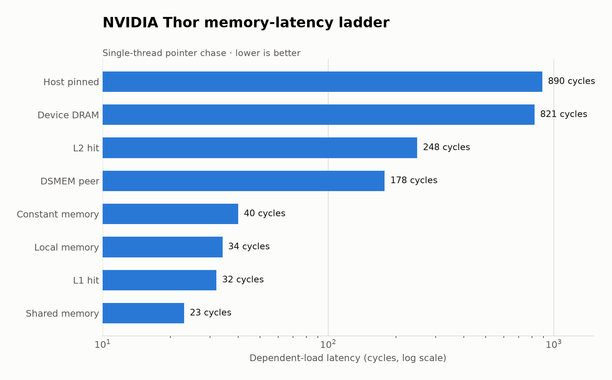
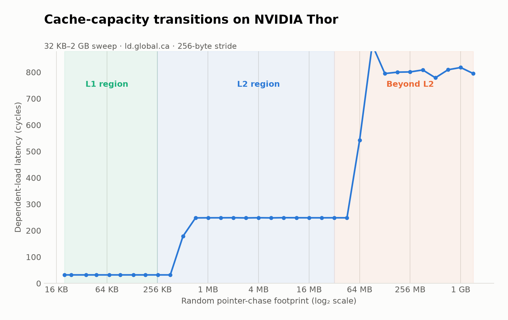
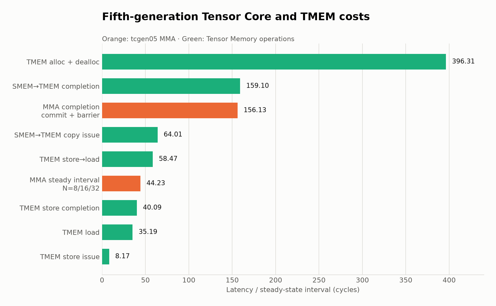

# NVIDIA Thor（Blackwell）延迟微基准测试报告

## 1. 测试范围

本报告只记录当前机器上的测试结果，不合并或修改仓库中已有的 H800 报告与结果。

- 测试时间：2026-08-09（UTC）
- 主机：`nvidia-dev-gpu`
- GPU：NVIDIA Thor
- 架构：Blackwell，compute capability 11.0 (`sm_110`)
- SM 数：20
- L2：32 MB
- Driver：595.78
- CUDA：13.3 (`V13.3.73`)
- GPU 数量：1
- 内存/地址模式：ATS；`nvidia-smi` 不提供独立显存容量

说明：当前设备是 Blackwell 架构的 NVIDIA Thor，并非 B100/B200。原套件针对 H800/Hopper 编写，本次按 `sm_110` 重编译并测试兼容项目。

### 核心结论

- 所有能在当前单卡 Thor 上执行的正式测试均通过；04 P2P 和 Hopper WGMMA 是硬件或架构限制，不属于测试失败。
- 依赖读延迟形成清晰台阶：shared 23、L1 32、DSMEM peer 178、L2 248、device DRAM 约 821 周期。
- 写指令的 4–8 周期发射间隔远小于可见性完成时间，分析性能时不能把 issue latency 当作 store→load latency。
- `tcgen05.mma` 的稳态间隔为 44.23 周期；逐条 commit/barrier 后的软件可见完成时间为 156.13 周期。
- TMEM store 约 8.17 周期即可发射，但 store completion 约 40.09 周期，store→load 往返约 58.47 周期。
- Thor 的频率会随测试轮次明显变化，因此跨轮次比较以 cycle 为主，纳秒只作为该轮频率下的换算值。

## 2. 测试状态

| 项目 | 状态 | 说明 |
|---|---|---|
| `01_mem_read` | 通过 | 哨兵检查全部通过 |
| `02_mem_write` | 通过 | 完整写发射、写读往返和可见性测试均通过哨兵 |
| `03_mem_levels` | 通过 | core、直方图、32 KB–2 GB sweep 完成；不支持的 cluster size 16 自动跳过 |
| `03b_l2_partition` | 运行通过 | 原始延迟有效；脚本自带的 Hopper 分区解释不适用于 Thor |
| `04_mem_p2p` | 不可执行 | 当前机器只有一张 GPU |
| `05_inst` | 通过 | 修复 `__vimax3_s32` 固定点优化后，全部哨兵与 SASS 检查通过 |
| `06_tensor` | 不适用 | 原测试使用 Hopper `wgmma`，不支持 `sm_110` |
| `06b_tcgen05` | 通过 | 新增 Blackwell 第五代 Tensor Core MMA latency 测试；SASS 与哨兵通过 |
| `06c_tmem` | 通过 | 新增 TMEM alloc/load/store/copy/wait 测试；SASS 与哨兵通过 |
| `07_sync` | 通过 | 哨兵检查全部通过 |
| `08_async_copy` | 通过 | 哨兵检查全部通过 |

## 3. 存储层次读延迟

最终整套回归中该轮实测 SM 频率为 1.126 GHz。

图 1：依赖读 latency 的对数阶梯。DSMEM peer 位于片上 cache 与 L2 之间；device DRAM 和 host pinned 明显更慢。

| 测量项 | 周期 | 纳秒 |
|---|---:|---:|
| shared memory | 23.00 | 20.44 |
| L1 hit（24 KB） | 32.00 | 28.43 |
| DSMEM self | 32.14 | 28.56 |
| local memory | 34.01 | 30.22 |
| constant memory | 39.92 | 35.47 |
| DSMEM peer（cluster=2） | 178.00 | 158.15 |
| L2 hit（32 MB） | 248.35 | 220.66 |
| device DRAM（脚本标签为 HBM） | 821.22 | 729.65 |
| host pinned | 889.89 | 790.66 |

注意：Thor 为 ATS/统一内存平台，脚本中的 `HBM` 和 `PCIe host` 标签沿用了 H800 测试命名，不能据此认定 Thor 存在与 H800 相同的独立 HBM/PCIe 数据路径。

### Cache operator（32 MB）

| operator | 周期 |
|---|---:|
| `.ca` | 248.34 |
| `.cg` | 248.34 |
| `.cs` | 229.74 |
| `.lu` | 248.34 |
| `.cv` | 246.34 |
| `.nc` | 248.34 |
| `relaxed.gpu` | 248.34 |
| `relaxed.sys` | 246.34 |

64-bit 与 128-bit 访问分别为 248.34 和 248.39 周期，基本一致。

### 写 latency

| 测量项 | 周期 |
|---|---:|
| shared store 发射间隔 | 4.03 |
| local store 发射间隔 | 4.03 |
| DSMEM peer store 发射间隔 | 4.17 |
| L1/L2 store 发射间隔 | 7.95 |
| device DRAM store 发射间隔 | 8.03 |
| shared store→load | 28.00 |
| DSMEM peer store→load | 176.00 |
| L1 store→load | 41.05 |
| L2 store→load | 266.59 |
| host pinned store→load | 1012.25 |
| device DRAM store→load（差分） | 911.85 |
| release.gpu→acquire.gpu | 646.22 |
| store.cg + membar.gl→load.cg | 616.97 |

写发射间隔仅表示指令进入流水线的速率，不表示数据已经对后续读取可见；因此与写读往返必须分开解释。

## 4. Core 与 DSMEM

最终整套回归中该轮实测频率为 1.567 GHz。

| 测量项 | 周期 |
|---|---:|
| SHF dependency chain | 4.12 |
| IMAD dependency chain | 4.12 |
| FFMA dependency chain | 4.11 |
| shared load | 23.00 |
| DSMEM self | 32.03 |
| DSMEM peer，cluster=2 | 177.89 |
| DSMEM peer，cluster=4 | 171.89 |
| DSMEM peer，cluster=8 | 172.89 |
| L1 hit | 32.00 |
| L2 hit | 248.45 |
| device DRAM | 797.77 |

cluster size 16 超出当前 GPU/资源组合的可启动范围，脚本现通过 occupancy API 预检并标为 N/A；
这不影响其余测试。直方图与完整 footprint sweep 均已完成：32–256 KB 为约 32 周期，
512 KB 为 174 周期，1–32 MB 为约 248 周期，64 MB 为 578 周期，128 MB–2 GB
约为 792–835 周期。

图 2：工作集从 32 KB 增长到 2 GB 时的 latency 台阶。约 512 KB 开始离开低延迟区，超过 32 MB 后进入明显的容量 miss 区域。

## 5. L2 地址/SM 延迟分布

测试覆盖 20 个 SM 和 8 个相距 8 MB 的地址。测得的两组中心差约 9–12.5 周期，各地址总体约为 240–269 周期。

- 只有 4/20 个 SM 在八个地址间同时出现过“近/远”翻转。
- 相邻 SM 对延迟一致率为 55/80，即 69%。
- 这些结果不支持直接沿用原脚本针对 Hopper 的“TPC 粒度、稳定双分区”结论。
- Thor 需要单独设计更多地址、重复物理分配和统计聚类测试后再判断 L2 拓扑。

## 6. 标量指令

最终整套回归中该轮实测 SM 频率为 1.561 GHz。

| 指令 | 依赖链周期 | 发射周期 |
|---|---:|---:|
| SHF | 4.11 | 2.02 |
| LOP3 | 4.11 | 2.02 |
| IMAD | 4.11 | 2.02 |
| FADD | 4.11 | 1.02 |
| FMUL | 4.11 | 1.02 |
| FFMA | 4.11 | 1.02 |
| FP64 DADD | 63.73 | 64.00 |
| FP64 DFMA | 63.84 | 64.00 |
| POPC | 18.00 | 8.01 |
| SHFL | 26.00 | 4.39 |
| REDUX | 44.05 | 11.29 |
| DPX `__viaddmax_s32` | 8.11 | 4.07 |
| DPX `__vimax3_s32` | 11.73 | 5.41 |

原 `__vimax3_s32(x,const,const)` 会在一次后达到固定点，被 ptxas 删除后续链。正式版本将第二输入改成依赖
前一结果的 `x ^ b`；SASS 中保留连续 `IMNMX` 依赖链，哨兵通过。

## 7. 同步、栅栏与原子

最终整套回归中该轮实测 SM 频率为 1.535 GHz。

| 测量项 | 周期 |
|---|---:|
| `barrier.sync` | 14.15 |
| `membar.cta` | 8.23 |
| `membar.gl` | 267.12 |
| `membar.sys` | 460.51 |
| mbarrier arrive + wait | 46.28 |
| cluster barrier relaxed | 73.67 |
| cluster barrier release | 340.77 |
| shared atomic add | 34.35 |
| global atomic add | 267.55 |
| global CAS | 274.58 |
| global RED add 发射间隔 | 6.11 |
| shared RED add 发射间隔 | 4.14 |

八个地址上的 global atomic add 范围为 247.62–270.63 周期，最大/最小为 1.09 倍。

## 8. Blackwell 第五代 Tensor Core（tcgen05）

新增 `06b_tcgen05.cu`，使用 Thor 原生 `sm_110f` 目标编译。测试指令为
`tcgen05.mma.cta_group::1.kind::f16`，覆盖 M64N{8,16,32}K16，输入 F16、TMEM 中累加 F32。
SASS 已确认核心指令为 `UTCHMMA`，提交/完成指令为 `UTCBAR`。

图 3：MMA 与 TMEM 的不同测量口径。图中同时包含稳态发射/间隔和等待完成的 latency，二者不能直接混为同一指标。

| 测量口径 | 周期 |
|---|---:|
| overwrite 连续发射，末尾一次 commit/wait | 44.23 |
| 同一 TMEM accumulator 依赖链，末尾一次 commit/wait | 44.23 |
| 每条 MMA 后 commit + mbarrier wait | 156.13 |

N=8、16、32 三种形状在这三个口径下分别得到相同周期值；N=8 的三轮复测也逐位一致。
前两项相同，说明在当前形状及生成的 SASS 下，覆盖写与同地址
累加没有表现出可分辨的额外依赖延迟；不能把 44.23 简单解释成数学流水线的单指令完成时间。
156.13 周期是软件可观测的端到端完成时间，包含 commit 和 mbarrier wait。

## 9. Tensor Memory（TMEM）

新增 `06c_tmem.cu`。纯 load 第一版被 ptxas 跨循环消除并触发哨兵，正式结果已改为
“上一次 load 结果决定下一次地址”的运行时零掩码依赖链；最终 SASS 可见 `LDTM`/`STTM`，
所有正式项目通过哨兵。三轮复测周期稳定（alloc/dealloc 仅约 1 周期波动）。

| 测量口径 | 周期 |
|---|---:|
| `tcgen05.alloc + dealloc`，32 columns | 395–396 |
| `tcgen05.ld 16x256b.x1`，TMEM→register 依赖链 | 35.19 |
| `tcgen05.st 16x256b.x1` 连发，末尾 wait | 8.17 |
| 每条 `tcgen05.st + wait::st` | 40.09 |
| TMEM store→load round trip | 58.47 |
| 空 `tcgen05.wait::ld` | 1.27 |
| 空 `tcgen05.wait::st` | 11.08 |
| `tcgen05.cp 128x256b`，SMEM→TMEM 连发，末尾 commit/wait | 64.01 |
| 每条 `tcgen05.cp 128x256b + commit/wait` | 159.10 |

TMEM store 的发射成本约 8 周期，但等待完成后约 40 周期；因此使用 TMEM 时应区分
“指令发出去”和“数据已经可读”。SMEM→TMEM copy 的端到端完成约 159 周期。

## 10. 异步搬运

最终整套回归中该轮实测 SM 频率为 1.563 GHz。

| 测量项 | 周期 | 纳秒 |
|---|---:|---:|
| L2 同步 load/store 基线 | 278.31 | 178.07 |
| L2 `cp.async .ca` 16 B | 282.37 | 180.67 |
| L2 `cp.async .cg` 16 B | 282.36 | 180.67 |
| L2 TMA global→shared | 298.23 | 190.82 |
| DRAM 同步基线 | 826.55 | 528.86 |
| DRAM `cp.async .cg` 16 B | 862.99 | 552.17 |
| DRAM TMA global→shared | 879.28 | 562.59 |
| TMA shared→global 发射 | 8.29 | 5.31 |
| TMA shared→global `wait.read` | 34.58 | 22.12 |
| TMA shared→global 完全完成 | 46.39 | 29.68 |

## 11. 测试限制与后续工作

1. Thor 频率在不同测试轮次约为 0.93–1.56 GHz，变化明显；比较本报告内部不同轮次时应优先使用周期。
2. `02_mem_write` 已确认完整通过；早先未返回来自测试会话并发问题，并非 kernel 挂起。
3. cluster size 16 在当前资源配置下确实无法启动，正式脚本会明确跳过。
4. Hopper `wgmma` 不能在 Thor 上运行；本报告已用 `tcgen05` 替代并覆盖三个 F16 N 形状。FP8/FP4、稀疏及双 CTA 需要不同描述符、scale/metadata 或双 CTA TMEM 编排，未把未经独立正确性验证的版本纳入正式 latency。
5. L2 拓扑需要 Thor 专用采样与分类逻辑，不能复用 Hopper 结论文字。
6. 双卡 P2P/NVLink 需要至少两张可互访 GPU，当前机器无法补测。
7. NCU counter 归属验证已实际尝试，但驱动返回 `ERR_NVGPUCTRPERM`；当前用户没有 GPU performance
   counter 权限。失败输出和退出码 1 已保留，软件侧三个 probe kernel 本身均可正常执行。

## 12. 原始结果

最终整套回归原始输出保存在 `Latency/results/blackwell-thor-20260809-124123/`。其中每个测试都有
独立 `.txt` 和 `.exit`，并保存了标量、tcgen05、TMEM 的 SASS。退出码汇总为：

- 0（通过）：01、02、03、03b、05、06b、06c、07、08，以及整套构建
- 77（硬件/架构跳过）：04（只有一张 GPU）、06（Hopper WGMMA）

`03_mem_levels-probe.txt` 的三个独立归属探针分别得到 L1 32.00、L2 248.38、device DRAM
808.08 周期；`03_mem_levels-csv.txt` 保存了 204 行 sweep/直方图机器可读数据，两项退出码均为 0。
`03_mem_levels-ncu.txt` 记录了因 `ERR_NVGPUCTRPERM` 无法采集硬件 counter 的原始诊断。

`environment.txt` 保存 GPU、驱动、CUDA、CPU、内存与拓扑快照。开发过程中的重复试跑文件未纳入
交付目录，避免与上述最终回归结果混淆。

可用 `./run_blackwell_thor.sh 0` 从构建到采集完整复现；每次运行会创建新的时间戳目录。

对应 `.exit` 文件记录各独立测试退出码。H800 的原报告和原始结果未作修改。

## 13. 实现依据

- NVIDIA PTX ISA：`tcgen05`、TMEM 指令的架构、线程协作与同步语义：<https://docs.nvidia.com/cuda/parallel-thread-execution/>
- NVIDIA CUTLASS tcgen05 programming guide：描述符、TMEM 分配和 MMA 编程模型：<https://docs.nvidia.com/cutlass/latest/media/docs/pythonDSL/mma_docs/tcgen05_programming.html>
