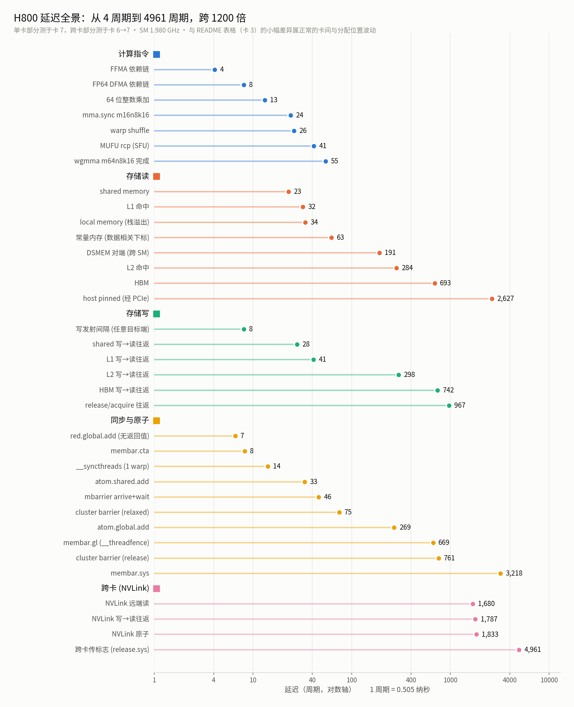

# GPUProfiling

GPU 微基准与性能剖析工具集。每个子目录是一个独立的测量类别，自带 README、一键运行脚本和结果存档。

平台：**NVIDIA H800 SXM (sm_90a)**，8 卡 NVSwitch 全互连，CUDA 13.1。

## 目录

| 目录 | 内容 | 状态 |
|---|---|---|
| [`Latency/`](Latency/) | **延迟微基准套件** —— 存储层次读写、指令、同步、异步搬运、NVLink | ✅ 可用 |

### `Latency/` 简介

按四大类组织，共 8 个 benchmark。全部是单线程/单 warp + 内联 PTX + 指针追逐/依赖链，**每个数字都用 SASS 复核过**，并配 NCU 硬件计数器、独立实现交叉校验、NVLink 计数器三重验证。

```
一、存储层次   01_mem_read   各存储空间读延迟 + cache operator + 访问宽度
              02_mem_write  各目标端写延迟 (发射间隔 / 写→读往返 / 可见性)
              03_mem_levels 容量台阶 / L2 近远分区 / NCU 归属探针
              04_mem_p2p    跨卡 NVLink 读写原子
二、指令延迟   05_inst       标量指令: 依赖链延迟 vs 发射间隔
              06_tensor     tensor core: mma.sync / wgmma
三、同步一致性 07_sync       barrier / fence / mbarrier / 原子
四、异步搬运   08_async_copy cp.async / TMA 双向
```

```bash
cd Latency
./run.sh      # 一键全跑(单卡), 固定卡 3, 结果存 results/
./p2p.sh      # 跨卡 NVLink, 固定卡 6->7
./ncu.sh      # NCU 交叉验证: 锁频复测 + 层级归属
make sass     # SASS 复核 —— 不是可选步骤
```



几个代表性结论（完整数据见 [`Latency/README.md`](Latency/README.md)）：

- **延迟跨度 1200 倍**：FFMA 依赖链 4.1 周期 → 跨卡传标志位 4962 周期（2.5 微秒）。
- **写的发射间隔与"写到哪里"完全无关**：写 L1 / L2 / HBM / PCIe 上的 host 内存 / NVLink 另一头的另一张卡，一律 8.11 周期。store 是 posted 的，目标端代价被完全隐藏。
- **写→读往返 ≈ 该层级读延迟 + 5~57 周期**。贵的永远是"读回来"那一趟。
- **NVLink 远端的行会进本地 L1，但不进本地 L2**：24KB 远端 footprint 读出 32.00 周期（与本地 L1 逐位相同），32MB 就跳到 1680。
- **`cp.async` 后面紧跟 `wait_group 0` 等于白写**：端到端 306 周期 vs 同步等价路径 302。
- **单地址的 L2 级延迟测量是双峰的**：同一原子操作在不同地址上差 1.94 倍（263 vs 510）。50MB L2 分成两半贴在 die 两个半区上，**近/远是 (SM, 地址) 这一对的属性** —— 132/132 个 SM 都同时出现过近和远，且决定远近的粒度是 TPC（相邻 2 个 SM 延迟 100% 相同）。

文档里另有 **11 个微基准陷阱**的记录（附录 B）—— ptxas 的强度削减、对合折叠、warp-uniform 消除、store-to-load forwarding、死存储消除等，**没有一个会报错**，全都是安静地给出一个"看起来很合理"的错数字。

## 约定

- **卡的使用**：单卡测量固定用**卡 3**（`DEV=N` 可覆盖）；跨卡测量用**卡 6 → 卡 7**。避免与他人任务互相干扰。
- **结果留档**：每次运行都写入 `<目录>/results/`，文件自带卡号、pstate、SM/显存频率、温度、nvcc 版本，便于回溯。
- **编译产物不入库**：见 `.gitignore`，`make all` 可重新生成。
