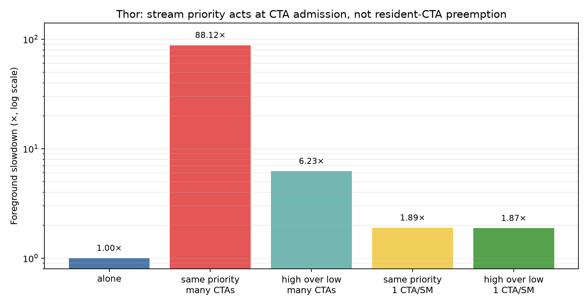

# NVIDIA Thor Stream Priority：CTA Admission 的实证边界

## 摘要

本报告研究 NVIDIA Thor（Blackwell，`sm_110`）上高优先级 CUDA stream 能否降低短任务在长后台任务下的排队延迟。实验分别构造“后台有大量尚未调度 CTA”和“每个 SM 仅启动一个长后台 CTA”两种状态。

短前台 kernel 单独运行需 0.1763 ms。后台存在大量 CTA wave 时，同优先级前台延迟升至 15.5314 ms；提高前台 stream priority 后降至 1.0979 ms，证明 priority 能改变 pending CTA 的 admission 顺序。每 SM 一个后台 CTA 时，高低 priority 前台分别为 0.3334/0.3303 ms，差异不可分辨。

第二组结果过去被解释为“priority 不能抢占 resident CTA”，但该结论强于实验设计：后台 CTA 只有 256 threads（8 warps），而 CC 11.0 每 SM 最多 48 resident warps，kernel 也没有用大 shared allocation 强制 occupancy=1；前台很可能直接共驻留。CUDA 官方语义确实说明 stream priority 不抢占 already-running work，但当前实验只独立验证 pending-work preference，未独立验证抢占粒度。

因此，本报告把硬件结论限制为：priority 能显著缓解 pending queue 的 head-of-line blocking；在资源仍可共驻留的 resident-background 场景，priority 不改善共享执行/带宽竞争。要验证 resident preemption，需要另行构造资源饱和 CTA 并用 occupancy/trace 证明前台无法共驻留。

## 1. 研究问题

并发吞吐实验观察到两个 stream 完成时间不对称，但 wall time 本身无法区分 memory fabric 竞争与 CTA admission 顺序。本实验回答：

1. 高优先级 stream 能否越过低优先级 stream 中尚未执行的 CTA？
2. 当前“每 SM 一个 CTA”控制组能否隔离 resident work preemption？
3. Stream priority 对低尾延迟服务的价值和边界是什么？

这里的调度指 kernel/CTA 获得 SM 资源的时机，不等同于 warp scheduler 的逐指令选择，也不直接等同于 CUDA context/操作系统层的 compute preemption。

## 2. Thor 的调度资源背景

Thor 官方示例报告 20 SM、每 SM 128 CUDA cores，并显示设备支持 compute preemption [R3]。CC 11.0 的软件可见上限是每 SM 48 resident warps、1536 threads，另有 64K registers 和最高 228 KiB shared memory 共同约束 occupancy [R4]。

```text
stream queues
    │  priority influences pending-work selection
    ▼
CTA admission ──► SM resident block slots / warps / registers / shared memory
                         │
                         ▼
                   warp schedulers / execution pipes / memory fabric
```

Stream priority 作用在上图的 pending-work selection。它不为高优先级 stream 预留独立 SM、L2 或 memory controller；即使前台及时共驻留，仍会与后台争用 warp issue 与 memory fabric。设备属性中的 “compute preemption supported” 也不能改写 Runtime API 对 stream priority 的具体契约；后者明确不承诺抢占已运行工作 [R1][R2]。

## 3. 方法

### 3.1 Stream 与提交顺序

- 日期：2026-08-09；
- GPU：NVIDIA Thor，`sm_110`，20 SM；
- stream：两个 `cudaStreamNonBlocking` stream；
- priority range：low=0，high=-5（数值越小优先级越高）。

Host 先提交后台，等待 500 μs 后记录前台 event 并提交前台，确保后台已开始。500 μs 发生在前台 event 之前，不计入前台时间。

### 3.2 前台与两类后台

前台固定启动 20 CTA，每 CTA 256 threads，单独运行 0.1763 ms。

1. **Many-waves background**：2000 CTA×8 rounds。20 SM 不可能同时驻留全部 CTA，队列中持续存在大量 pending work，适合测试 priority 是否改变 admission 顺序。
2. **One-CTA-per-SM background**：20 CTA×800 rounds。它消除了后续 pending wave，但每 CTA 只有 8 warps，也没有大 shared allocation；它测试“无后台 CTA 队列时 priority 是否仍改善共执行”，而不是严格的 resident-preemption test。

若要构造真正的抢占测试，应先用 `cudaOccupancyMaxActiveBlocksPerMultiprocessor` 验证每 SM 只能驻留一个后台 CTA，并通过接近 228 KiB 的 dynamic shared memory 或足够 register/thread 配置耗尽 admission 资源。当前代码没有做这一步。

### 3.3 编译与计时审计

后台循环每轮改变访问位置，防止编译器把 global load 提出循环；SASS 确认 `LDG` 位于循环内。前后台使用独立 non-blocking stream，前台 elapsed event 只包围前台提交到完成区间。

## 4. 结果



| 后台形态 | 前后台 priority | 前台时间 | 相对单独运行 |
|---|---:|---:|---:|
| 无后台 | — | 0.1763 ms | 1.000× |
| 2000 CTA，多 waves | 相同 | 15.5314 ms | 88.118× |
| 2000 CTA，多 waves | 前台高 | 1.0979 ms | 6.229× |
| 20 CTA，每 SM 平均一个 | 相同 | 0.3334 ms | 1.892× |
| 20 CTA，每 SM 平均一个 | 前台高 | 0.3303 ms | 1.874× |

Many-waves 场景中，priority 把前台时间降低约 14.1×，但仍比独占慢 6.23×。这说明高优先级 CTA 获得了更早 admission，却仍需等待部分资源释放并与后台争用执行/memory 服务。

20-CTA 场景下，高低 priority 只差 0.0031 ms（不足 1%）。此时没有长 pending queue 可供重排；前台 slowdown 约 1.9×更符合共驻留后的 bandwidth/issue competition。该数据不要求发生 resident CTA 抢占，也不能区分硬件是否具备其他上下文级抢占机制。

## 5. 机制分析

### 5.1 Priority 确实改变 pending CTA admission

同优先级时，先提交的 2000 个后台 CTA 持续占据 admission 机会，短前台排在大量 pending work 之后。提高前台 priority 后，调度器在下一次选择可驻留 CTA 时优先考虑前台，足以解释 15.53→1.10 ms，无需假设已驻留 CTA 被中断。

这一结果与 CUDA 语义吻合：higher-priority pending work 在可能时优先，但 priority 是 hint，不保证严格顺序 [R1][R2]。

### 5.2 One-CTA-per-SM 是共驻留控制，不是抢占控制

一个 256-thread CTA 占 8 warps。相对于 CC 11.0 的 48-warps/SM 上限，它没有仅凭线程数耗尽 SM；源码也没有 dynamic shared memory。前台 CTA 因而有资源直接共驻留，并在同一 memory fabric 上与后台竞争。

所以 0.3334≈0.3303 ms 支持的是：**没有 pending 后台 wave 时，priority 不会为已可共驻留的前台复制执行或内存资源。** 它不能独立支持“高优先级不抢占 resident CTA”。后一个命题由 CUDA API 契约明确给出 [R1]，硬件实证仍待 resource-saturating CTA/CUPTI trace。

### 5.3 Compute preemption 与 stream priority 不是同一层

官方 Thor `deviceQuery` 报告 compute preemption supported [R3]，通常表示平台具备某种计算上下文保存/切换能力；Runtime API 同时明确 stream priority 不抢占 already-running work [R1]。二者并不矛盾：能力可能服务于 context/OS 调度或更粗粒度机制，不代表同一 CUDA context 内的高优先级 stream 获得指令级抢占权。

## 6. 工程含义

1. 高优先级 stream 适合越过低优先级 pending grid，能显著降低大量 CTA wave 造成的排队；
2. 它不会提供独立 SM 或 memory bandwidth，前台共驻留后仍可能被后台拖慢；
3. 低尾延迟 kernel 应保留 register/shared/warp 余量，提高共驻留概率；
4. 长后台任务应缩短 CTA 或分批提交，增加 admission 边界；
5. Deadline/正确性不能依赖 priority 的严格顺序保证；
6. 真正的 preemption 研究必须验证 occupancy=1 并采集 CTA timeline，而不是只看两个 CUDA event。

## 7. 有效性边界与下一实验

当前测试只覆盖单进程、单 CUDA context、单 GPU。下一步最关键的不是再换几个 priority 数，而是补足因果控制：

- 用约 228 KiB dynamic shared memory 强制后台 occupancy=1 CTA/SM；
- 用 occupancy API 记录实际 active-block 上限；
- 扫描后台 CTA runtime 与 resource footprint；
- 用 CUPTI/Nsight Systems 观察前台 CTA 首次 admission；
- 再扩展到跨进程、MPS、MIG/green context。

在完成这些实验前，本报告不声称测得 Thor 的 instruction-level preemption 粒度。

## 8. 结论

本机数据强力证明 stream priority 能重排 pending CTA：many-waves 后台下，前台从 15.53 ms 降至 1.10 ms。每 SM 一个 8-warp 后台 CTA 时 priority 无收益，说明没有 pending queue 可重排且共享执行资源仍造成约 1.9× slowdown；由于前台可以共驻留，这不是 resident-preemption test。CUDA 文档规定 priority 不抢占已运行工作，但需要资源饱和 CTA 与 timeline 才能把该规则转化为本机微架构实证。

## 9. 参考与数据

- [R1] NVIDIA, [CUDA Programming Guide — Stream Priorities](https://docs.nvidia.com/cuda/cuda-programming-guide/03-advanced/advanced-host-programming.html#stream-priorities).
- [R2] NVIDIA, [CUDA Runtime API — Stream Management](https://docs.nvidia.com/cuda/cuda-runtime-api/group__CUDART__STREAM.html).
- [R3] NVIDIA, [Jetson AGX Thor Developer Kit — CUDA deviceQuery](https://docs.nvidia.com/jetson/agx-thor-devkit/user-guide/latest/setup_cuda.html).
- [R4] NVIDIA, [CUDA Programming Guide — Compute Capabilities](https://docs.nvidia.com/cuda/cuda-programming-guide/05-appendices/compute-capabilities.html).
- 原始输出：[`results/thor-stream-priority-20260809-155136.txt`](results/thor-stream-priority-20260809-155136.txt)
- SASS：[`results/01_stream_priority.sass.txt`](results/01_stream_priority.sass.txt)
